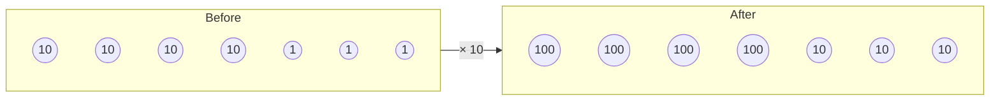
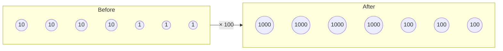
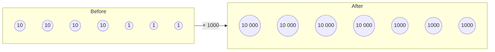
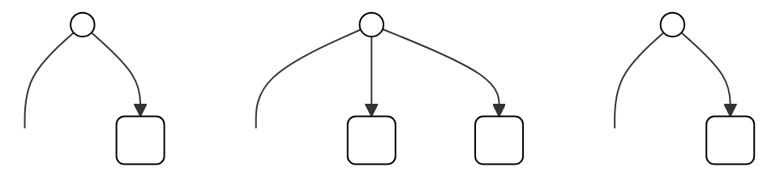

<!-- page 1 -->
U.S. EDITION stamp

# PRIMARY MATHEMATICS 5A

TEXTBOOK

Illustration of children playing on large 3D numbers and mathematical symbols

Marshall Cavendish Education logo

SM logo with website link
http://kidworkbook.blogspot.com to re-order

<!-- page 2 -->
# CONTENTS

1 **Whole Numbers**
1 Place Values 6
2 Millions 8
PRACTICE 1A 10
3 Approximation and Estimation 11
PRACTICE 1B 14
4 Multiplying by Tens, Hundreds or Thousands 15
5 Dividing by Tens, Hundreds or Thousands 17
6 Order of Operations 19
PRACTICE 1C 21
7 Word Problems 22
PRACTICE 1D 25

2 **Multiplication and Division by a 2-digit Whole Number**
1 Multiplication 26
2 Division 28
PRACTICE 2A 32

3 **Fractions**
1 Fraction and Division 33
PRACTICE 3A 36
2 Addition and Subtraction of Unlike Fractions 37
PRACTICE 3B 40
3 Addition and Subtraction of Mixed Numbers 41
PRACTICE 3C 43
4 Product of a Fraction and a Whole Number 44
PRACTICE 3D 48
5 Product of Fractions 49
PRACTICE 3E 52
6 Dividing a Fraction by a Whole Number 53
PRACTICE 3F 55
7 Word Problems 56
PRACTICE 3G 60

**REVIEW A** 61

<!-- page 3 -->
Chapter 4 icon **Area of Triangle**
1 Finding the Area of a Triangle 65
PRACTICE 4A 70

Chapter 5 icon **Ratio**
1 Finding Ratio 71
2 Equivalent Ratios 75
PRACTICE 5A 79
3 Comparing Three Quantities 80
PRACTICE 5B 82

Chapter 6 icon **Angles**
1 Measuring Angles 83
2 Finding Unknown Angles 85

**REVIEW B** 89

**REVIEW C** 93

<!-- page 4 -->
# 1 Whole Numbers

## 1 Place Values

This block is made up of unit cubes.
How many unit cubes are there?

Large block made of unit cubes

Thought bubble showing 1000 unit cubes and 10,000 unit cubes

**200,000**

**two hundred thousand**

Illustration of a girl thinking

<!-- page 5 -->
1. A library has a collection of 124,936 books.

Illustration of a thought bubble containing the number 124,936 broken down into place value cards and written in words

Place value cards showing 100,000, 20,000, 4,000, 900, 30, and 6

one hundred twenty-four thousand, nine hundred thirty-six

The number 124936 in a box

Illustration of a boy thinking

Down arrow icon

<table>
  <thead>
    <tr>
        <th>Hundred thousands</th>
        <th>Ten thousands</th>
        <th>Thousands</th>
        <th>Hundreds</th>
        <th>Tens</th>
        <th>Ones</th>
    </tr>
  </thead>
  <tbody>
    <tr>
        <td>1</td>
        <td>2</td>
        <td>4</td>
        <td>9</td>
        <td>3</td>
        <td>6</td>
    </tr>
  </tbody>
</table>

(a) In 124,936, the digit 2 is in the ten thousands place.

Its value is     .

(b) The digit 1 is in the hundred thousands place.

Its value is     .

2. Write the following in words.

(a) 435,672 (b) 500,500 (c) 404,040

(d) 345,713 (e) 700,370 (f) 311,012

(g) 840,382 (h) 600,005 (i) 999,999

3. Write the following in figures.

(a) Four hundred one thousand, sixty-two

(b) Nine hundred seventy thousand, five hundred five

(c) Seven hundred thousand, nine

<!-- page 6 -->
Illustration of a house with a "FOR SALE $2 MILLION" sign

The selling price of the house is **$2 million**.
How many one-thousand-dollar notes do you need to buy the house?

Illustration of a boy and a girl with thought bubbles. The boy's bubble says: "1 million = 1000 thousands, 2 millions =      thousands". The girl's bubble says: "We write $2 million as $2,000,000."

1

<!-- page 7 -->
1. (a) According to the 1980 census, the population of Singapore was about 2,414,000.

We read 2,414,000 as two million, four hundred fourteen thousand.

In 2,414,000, the digit      is in the millions place. girl character

(b) According to the 1990 census, the population of Singapore has exceeded 3,000,000.

> We read 3,000,000 as three million.

In 3,000,000, the digit 3 is in the      place. boy character

2. Write the following in words.

(a) 5,000,000

(b) 4,126,000

(c) 3,690,000

(d) 6,800,000

3. Write the following in figures.

(a) Six million

(b) Seven million, three thousand

(c) Eight million

(d) Nine million, twenty-three thousand

<!-- page 8 -->
# PRACTICE 1A

1. Write the following in figures.

(a) Eleven thousand, twelve

(b) One hundred fifteen thousand, six hundred

(c) Seven hundred thousand, thirteen

(d) Eight hundred eighty thousand, five

(e) Five million

(f) Four million, two hundred thousand

(g) Ten million

(h) Eight million, eight thousand

2. Write the following in words.

(a) 207,306 (b) 560,003 (c) 700,000

(d) 3,450,000 (e) 6,020,000 (f) 4,003,000

3. What is the value of the digit 8 in each of the following?

(a) 72,845 (b) 80,375 (c) 901,982

(d) 810,034 (e) 9,648,000 (f) 8,162,000

4. What are the missing numbers?

(a) 16,500 = 10,000 +      + 500

(b) 225,430 =      + 20,000 + 5000 + 400 + 30

(c) 100,000 + 80,000 + 4000 + 900 =     

(d) 7,000,000 + 600,000 + 9000 =     

(e) 9,000,000 + 20,000 + 1000 =     

(f) 8,532,000 = 8,000,000 + 500,000 +      + 2000

5. Complete the following number patterns.

(a) 42,668, 43,668,     ,     , 46,668

(b) 70,500, 71,500, 72,500,     ,     

(c) 83,002, 93,002,     ,     , 123,002

(d) 5,632,000, 5,642,000,     ,     , 5,672,000

(e) 9,742,000, 8,742,000,     , 6,742,000,     

6. Arrange the numbers in increasing order.

(a) 53,760, 53,670, 56,370, 53,607

(b) 324,468, 342,468, 324,648, 342,486

(c) 2,537,000, 2,357,000, 3,257,000, 425,700

<!-- page 9 -->
# 3 Approximation and Estimation

4865 people watched a badminton match.

Illustration of a badminton match with spectators

There are about 4900 people.

<table>
  <tbody>
    <tr>
        <td>4800</td>
        <td>4850</td>
        <td>4865</td>
        <td>4900</td>
    </tr>
  </tbody>
</table>

Sally rounds off 4865 to the nearest hundred.

4865 ≈ 4900

4865 is **approximately** 4900.

There are about 5000 people. Illustration of a girl speaking

<table>
  <tbody>
    <tr>
        <td>4000</td>
        <td>4500</td>
        <td>4865</td>
        <td>5000</td>
    </tr>
  </tbody>
</table>

Jenny rounds off 4865 to the nearest thousand.

4865 ≈ 5000

4865 is **approximately** 5000.

<!-- page 10 -->
1. There are 487 pages in a book.
Round off the number of pages to the nearest ten.

Number line showing 487 between 480 and 490, with 485 marked as the midpoint.

487 ≈     

2. Round off each number to the nearest 10.

(a) 604 (b) 795 (c) 999

3. 5714 people visited a book fair.
Round off the number of visitors to the nearest hundred.

Number line showing 5714 between 5700 and 5800, with 5750 marked as the midpoint.

5714 ≈     

4. Round off each number to the nearest 100.

(a) 3650 (b) 6047 (c) 4995

5. Round off 16,500 to the nearest thousand.

> 16,500 is halfway between 16,000 and 17,000.
> We take 17,000 as the nearest 1000.

Number line showing 16,500 as the midpoint between 16,000 and 17,000.

16,500 ≈     

6. Round off each number to the nearest 1000.

(a) 23,490 (b) 54,550 (c) 39,900

<!-- page 11 -->
To round off a number to the nearest thousand, we look at the digit in the hundreds place. If it is 5 or greater than 5, we round up; if it is smaller than 5, we round down.

7. Round off each number to the nearest 1000.

(a) 49,287 ≈ 49,000      (b) 73,501 ≈     

(c) 804,390 ≈      (d) 129,500 ≈     

8. Find the value of 1800 ÷ 3.
> 18 hundreds ÷ 3 = 6 hundreds

1800 ÷ 3 =     

Illustration of a boy thinking

9. Find the value of

(a) 27,000 + 6000 (b) 45,000 - 8000

(c) 7000 × 4 (d) 3500 ÷ 5

10. Estimate the value of 2934 × 6.

2934 × 6 ≈ 3000 × 6

=     

11. Estimate the value of 5423 ÷ 8.
> (4800 and 5600 are multiples of 8. Take 5423 ≈ 5600.)

5423 ÷ 8 ≈ 5600 ÷ 8

=     

Illustration of a girl thinking

2

12. Estimate the value of

(a) 6390 + 5992 (b) 78,123 + 8969

(c) 8307 - 4265 (d) 45,627 - 7324

(e) 3806 × 9 (f) 9794 × 5

(g) 4785 ÷ 6 (h) 3782 ÷ 4

<!-- page 12 -->
1. Round off each number to the nearest 10.

(a) 72 (b) 655 (c) 1289

2. Round off each number to the nearest 100.

(a) 342 (b) 1259 (c) 20,753

3. Round off each number to the nearest 1000.

(a) 6850 (b) 10,500 (c) 125,498

4. David bought a television set for $849.
Round off this amount to the nearest hundred dollars.

5. Mr. Ray bought a car for $69,500.
Round off this amount to the nearest thousand dollars.

6. A spaceship traveled 999,540 km.
Round off this distance to the nearest 1000 km.

7. This table shows the number of people living in three towns.

(a) Round off the number of people in each town to the nearest 1000.

(b) Use your answers in part (a) to estimate the total number of people in the 3 towns.

> **Number of people**
>
> Town A : 179,920
> Town B : 176,392
> Town C : 170,500

8. Round each number to the nearest 1000.
Then estimate the value of

(a) 32,370 + 4959 (b) 24,890 + 5016

(c) 48,207 − 9864 (d) 54,500 − 6892

9. Estimate the value of

(a) 8659 × 4 (b) 6023 × 9

(c) 7080 ÷ 8 (d) 4378 ÷ 7

4

<!-- page 13 -->
# 4 Multiplying by Tens, Hundreds or Thousands

43 × 10 = 430

Illustration of a girl thinking about multiplying 1 by 10 to get 10, and 10 by 10 to get 100

43 × 100 = 4300

Illustration of a boy thinking about multiplying 1 by 100 to get 100, and 10 by 100 to get 1000

43 × 1000 = 43,000

Illustration of a girl thinking about multiplying 1 by 1000 to get 1000, and 10 by 1000 to get 10 000
Illustration of a girl's head

<!-- page 14 -->
1. Multiply.
(a) 328 × 10 (b) 100 × 536 (c) 63 × 1000

2. Multiply 16 by 70.
16 × 70 = 16 × 7 × 10
= 112 × 10
= 1120

> Multiply 16 by 7 first.
> 16
> × 7
> \_\_\_\_
> 112
> Illustration of a boy thinking

3. Multiply 48 by 3.
Then find the value of
(a) 48 × 30 (b) 48 × 300 (c) 48 × 3000

4. Multiply 450 by 6.
Then find the value of
(a) 450 × 60 (b) 450 × 600 (c) 450 × 6000

5. Multiply.
(a) 200 × 500 (b) 600 × 900 (c) 800 × 6000
(d) 500 × 2000 (e) 4000 × 600 (f) 2000 × 5000

6. Estimate the value of 702 × 19.
702 × 19 ≈ 700 × 20
=     

> 702 ≈ 700
> 19 ≈ 20
> Illustration of a boy thinking

7. Mrs. Bates needs 543 costumes for the students to take part in a parade. Each costume costs $35. Give a quick estimate of the total cost of the costumes.
35 × 543 ≈ 40 × 500
= 20,000
The total cost is about $20,000.

8. Estimate the value of
(a) 529 × 34 (b) 75 × 386 (c) 7804 × 59

<!-- page 15 -->
# 5 Dividing by Tens, Hundreds or Thousands

Diagram showing 2300 represented by place value discs (two 1000s and three 100s) being divided by 10 to become 230 (two 100s and three 10s)

Illustration of a boy thinking about place value division: 1000 divided by 10 equals 100, and 100 divided by 10 equals 10

2300 ÷ 10 = 230

Diagram showing 2300 represented by place value discs (two 1000s and three 100s) being divided by 100 to become 23 (two 10s and three 1s)

Illustration of a girl thinking about place value division: 1000 divided by 100 equals 10, and 100 divided by 100 equals 1

2300 ÷ 100 = 23

Diagram showing 23,000 represented by place value discs (two 10,000s and three 1000s) being divided by 1000 to become 23 (two 10s and three 1s)

Illustration of a boy thinking about place value division: 10,000 divided by 1000 equals 10, and 1000 divided by 1000 equals 1

23,000 ÷ 1000 = 23

<!-- page 16 -->
1. Divide.

(a) $520 \div 10$

(b) $7400 \div 100$

(c) $40,000 \div 1000$

2. (a) Divide 15,000 by 30.

$15,000 \div 30 = 15,000 \div 10 \div 3$
$= 1500 \div 3$
$= 500$

Illustration of a girl thinking "15,000 ÷ 30"

(b) Divide 15,000 by 300.

$15,000 \div 300 = 15,000 \div 100 \div 3$
$= 150 \div 3$
$= 50$

Illustration of a girl thinking "15,000 ÷ 300"

(c) Divide 15,000 by 3000.

$15,000 \div 3000 = 15,000 \div 1000 \div 3$
$= 15 \div 3$
$= 5$

Illustration of a girl thinking "15,000 ÷ 3000"

3. Divide.

(a) $280 \div 40$

(b) $64,000 \div 800$

(c) $200,000 \div 5000$

4. Estimate the value of $2992 \div 38$.

$2992 \div 38 \approx 2800 \div 40$

=     

Illustration of a boy thinking "2992 ≈ 2800, 38 ≈ 40"

5. Maria paid $959 for 33 copies of a software. Give a quick estimate of the cost per copy.

$959 \div 33 \approx 900 \div 30$
$= 30$

The cost per copy was about $30.

6. Estimate the value of

(a) $6398 \div 81$

(b) $2205 \div 34$

(c) $638 \div 67$

<!-- page 17 -->
# 6 Order of Operations

Matthew arranges his stamps on two pages of his stamp album like this:

<table>
  <thead>
    <tr>
        <th>Group 1</th>
        <th>Group 2</th>
    </tr>
  </thead>
  <tbody>
    <tr>
        <td>10 stamps in a triangle</td>
        <td>12 stamps in a 3x4 grid</td>
    </tr>
    <tr>
        <td>10</td>
        <td>4 × 3 = 12</td>
    </tr>
  </tbody>
</table>

Then he finds the total number of stamps.

$$ 10 + 4 \times 3 = 10 + 12 $$
$$ = 22 $$

Thought bubble: Do multiplication first.
Illustration of a boy thinking

There are 22 stamps altogether.

> **Order of Operations:**
>
> **Do multiplication or division from left to right, then addition or subtraction from left to right.**

<!-- page 18 -->
1. Find the value of

(a) $12 + 8 - 10$ (b) $60 - 12 - 24$ (c) $31 - 19 + 11$

(d) $43 + 16 - 27$ (e) $64 + 26 + 57$ (f) $90 - 12 + 21$

(g) $55 + 69 - 25$ (h) $111 - 89 - 11$ (i) $58 - 25 + 42$

2. Find the value of

(a) $2 \times 4 \times 8$ (b) $60 \div 4 \div 3$ (c) $54 \div 6 \times 3$

(d) $9 \times 8 \times 6$ (e) $72 \div 6 \div 4$ (f) $4 \times 24 \div 8$

(g) $4 \times 7 \times 25$ (h) $64 \div 8 \div 8$ (i) $9 \times 81 \div 9$

3. Find the value of

(a) $9 + 3 \times 6$ (b) $27 - 12 \div 3$ (c) $4 + 15 \times 12$

(d) $80 - 5 \times 10$ (e) $54 - 48 \div 6$ (f) $9 + 81 \div 9$

(g) $56 - 8 \times 5 + 4$ (h) $70 + 80 \div 5 \times 4$ (i) $96 \div 8 - 6 \times 2$

(j) $6 + 54 \div 9 \times 2$ (k) $49 - 45 \div 5 \times 3$ (l) $62 + 42 \div 7 - 6$

Workbook Exercise 7

4. Find the value of $27 - 2 \times (3 + 5)$.

$27 - 2 \times \mathbf{(3 + 5)}$
$= 27 - 2 \times 8$
$=     $

> Do what is in the parentheses first.

Illustration of a girl thinking

5. Find the value of

(a) $76 + (36 + 164)$ (b) $200 - (87 - 13)$ (c) $99 - (87 + 12)$

(d) $18 \times (5 \times 2)$ (e) $490 \div (7 \times 7)$ (f) $153 \times (27 \div 9)$

6. Find the value of

(a) $60 \div (4 + 8)$ (b) $20 - 2 \times (18 \div 6)$

(c) $25 + (5 + 7) \div 3$ (d) $(22 + 10) \div 8 \times 5$

(e) $(50 - 42) \div 2 \times 7$ (f) $100 \div 10 \times (4 + 6)$

Workbook Exercise 8

<!-- page 19 -->
# PRACTICE 1C

1. Multiply.

(a) 238 × 10 (b) 700 × 100 (c) 37 × 1000

(d) 10 × 400 (e) 100 × 280 (f) 1000 × 520

2. Multiply 56 by 7.

Then find the value of

(a) 56 × 70 (b) 56 × 700 (c) 56 × 7000

3. Multiply 75 by 9.

Then find the value of

(a) 75 × 90 (b) 75 × 900 (c) 75 × 9000

4. Divide 72 by 8.

Then find the value of

(a) 720,000 ÷ 80 (b) 720,000 ÷ 800 (c) 720,000 ÷ 8000

5. Divide 900 by 6.

Then find the value of

(a) 90,000 ÷ 60 (b) 90,000 ÷ 600 (c) 90,000 ÷ 6000

6. Divide.

(a) 360 ÷ 90 (b) 7600 ÷ 40 (c) 90,600 ÷ 600

(d) 4080 ÷ 80 (e) 350,000 ÷ 500 (f) 412,000 ÷ 4000

7. Find the value of

(a) 48 − 17 + 25 (b) 6 × 5 × 10

(c) 81 ÷ 9 ÷ 3 (d) 50 ÷ 5 + 5

(e) 64 − 3 × 9 (f) 72 − 36 ÷ 9

(g) 27 + 15 ÷ 3 × 2 (h) 40 ÷ 2 − 2 × 5

(i) 10 + 24 ÷ 8 + 8 (j) (38 − 17) ÷ 3 × 10

(k) 35 ÷ (10 − 3) × 10 (l) (13 + 7) ÷ (9 − 4)

8. Find the value of

(a) 372 − (45 − 29) (b) 372 − 45 + 29

(c) 372 − 45 − 29 (d) 372 − (45 + 29)

(e) 128 ÷ 4 ÷ 2 (f) 128 ÷ (4 × 2)

(g) 128 ÷ 4 × 2 (h) 128 ÷ (4 ÷ 2)

<!-- page 20 -->
# 7 Word Problems

Alicia bought 420 mangoes for $378. She packed the mangoes in bags of 4 mangoes each and sold all the mangoes at $6 per bag. How much money did she make?

Bar model showing 420 mangoes divided into units of 4
4 mangoes in 1 bag
420 mangoes in      bags.
Thinking bubble icon

$420 \div 4 = 105$

There were 105 bags of mangoes.

1 bag for $6
105 bags for $    
Thinking bubble icon

2.

$\$6 \times 105 = \$630$

Alicia sold the mangoes for $630.

Selling price - Cost price =     
Thinking bubble icon

$\$630 - \$378 = \$    $
Thinking bubble icon

Alicia made $    .

<!-- page 21 -->
1. Ryan and Juan shared $410 between them. Ryan received $100 more than Juan. How much money did Juan receive?

Bar model showing Ryan with one unit plus $100 and Juan with one unit, totaling $410. A cartoon character says: "Give Ryan $100 first and divide the remaining money into two units."

2 units = $410 - $100
= $310
1 unit = $    

Juan received $    .

2. Peter collected a total of 1170 stamps. He collected 4 times as many U.S. stamps as foreign stamps. How many U.S. stamps did he collect?

Bar model showing Foreign stamps as one unit and U.S. stamps as four units, with a total of 1170. There is a question mark under the U.S. stamps bar.

<!-- page 22 -->
3. Mr. Given bought 2 similar T-shirts and a belt. He paid $50 to the cashier and received $3 change. If the belt cost $29, find the cost of each T-shirt.

Bar model showing total cost of $47 with a belt costing $29 and two unknown units for T-shirts. A thought bubble says "The total cost of 2 T-shirts and 1 belt is $47."

$$$50 - $3 = $47$$

Mr. Given spent $47.

$$$47 - $29 = $18$$

The T-shirts cost $18.

$$$18 \div 2 = \$    $$

The cost of each T-shirt was $    .

4. Henry bought a compact disc and 3 videotapes. The compact disc cost $16. If a compact disc cost twice as much as a videotape, how much did he spend altogether?

Bar model comparing CD cost of $16 (2 units) to Tape cost (1 unit).

$$$16 \div 2 = $8$$

A videotape cost $8.

$$$8 \times 3 = $24$$

The cost of 3 videotapes was $24.

Thought bubble saying "He bought 3 videotapes and 1 compact disc."

$$$24 + $16 = \$    $$

He spent $     altogether.

Illustration of a girl smiling

<!-- page 23 -->
# PRACTICE 1D

1. John is 15 kg heavier than Peter. Their total weight is 127 kg. Find John's weight.

2. There are 3 times as many boys as girls. If there are 24 more boys than girls, how many children are there altogether?

3. The total weight of Peter, David and Henry is 123 kg. Peter is 15 kg heavier than David. David is 3 kg lighter than Henry. Find Henry's weight.

4. Pablo has $180 and Ryan has $150. How much money must Pablo give Ryan so that they each will have an equal amount of money?

5. Matthew has twice as many stickers as David. How many stickers must Matthew give David so that they each will have 120 stickers?

6. Peter has twice as many stickers as Joe. Joe has 40 more stickers than Emily. They have 300 stickers altogether. How many stickers does Peter have?

7. At a book fair, Joe bought 24 books at 3 for $5 and had $2 left. How much money did he have at first?

8. Ryan bought 3 books and a magazine. He paid $30 to the cashier and received $5 change. If the magazine cost twice as much as each book, find the cost of the magazine.

9. Harry bought 155 oranges for $35. He found that 15 of them were rotten. He sold all the remaining oranges at 7 for $2. How much money did he make?

10. John and Paul spent $45 altogether. John and Henry spent $65 altogether. If Henry spent 3 times as much as Paul, how much did John spend?

<!-- page 24 -->
1

2

# icon Multiplication

(a) Multiply 78 by 30.

3

## Method 1:

$78 \times 30 = 78 \times 3 \times 10$
$= 234 \times 10$
$= 2340$

> Multiply 78 by 3 first.
>
> 78
> $\times$ 3
> \_\_\_\_
> 234

Illustration of a girl thinking

## Method 2:

78
$\times$ 30
\_\_\_\_
2340

4.

5.

(b) Multiply 650 by 40.

650
$\times$ 40
\_\_\_\_\_
26000

6.

<!-- page 25 -->
1. Multiply.

(a) 53
$\times$ 60
gray box

(b) 247
$\times$ 80
gray box

2. Multiply.

(a) 58 $\times$ 80
(b) 46 $\times$ 50
(c) 27 $\times$ 90
(d) 207 $\times$ 60
(e) 739 $\times$ 40
(f) 641 $\times$ 70

3. Multiply.

(a) 24
$\times$ 13
72 $\leftarrow$ 24 $\times$ 3
240 $\leftarrow$ 24 $\times$ 10
312

(b) 52
$\times$ 47
    

(c) 325
$\times$ 54
1300 $\leftarrow$ 325 $\times$ 4
16250 $\leftarrow$ 325 $\times$ 50
    

(d) 618
$\times$ 72
    

4. Multiply.

(a) 67 $\times$ 44
(b) 53 $\times$ 48
(c) 29 $\times$ 96
(d) 236 $\times$ 82
(e) 457 $\times$ 35
(f) 606 $\times$ 47

5. Multiply.

(a) 4635
$\times$ 26
gray box

(b) 8247
$\times$ 38
    

6. Multiply.

(a) 3059 $\times$ 53
(b) 7105 $\times$ 62
(c) 2537 $\times$ 48
(d) 3860 $\times$ 69
(e) 6394 $\times$ 57
(f) 5482 $\times$ 74

<!-- page 26 -->
# 2 Division

(a) Divide 140 by 20.

## Method 1:

140 ÷ 20 = 7

Illustration of a girl thinking "140 ÷ 20" with the zeros crossed out

## Method 2:

$$ \begin{array}{r} 7 \\ 20 \enclose{longdiv}{140} \\ \underline{140} \\ 0 \end{array} $$

Illustration of a boy thinking "7 × 20 = 140"

(b) Divide 150 by 20.

$$ \begin{array}{r} 7 \\ 20 \enclose{longdiv}{150} \\ \underline{140} \\ 10 \end{array} $$

Illustration of a boy thinking "150 ÷ 20" with the zeros crossed out, and the text: "I cannot divide 15 by 2 exactly. So I use method 2."

<!-- page 27 -->
1. Divide.

(a)     30)70

(b)     60)430

(c)     20)89

(d)     70)625

2. Divide.

(a) 90 ÷ 50

(b) 79 ÷ 40

(c) 85 ÷ 30

(d) 540 ÷ 70

(e) 613 ÷ 90

(f) 438 ÷ 60

3. Divide 74 by 21.

      **3**21)74     63     11

Illustration of a boy thinking about a division problem: 3 / 20)74. The thought bubble says "The estimated quotient is 3."

4. Divide 256 by 47.

      **5**47)256     235      21

Illustration of a boy thinking about a division problem: 5 / 50)256. The thought bubble says "The estimated quotient is 5."

5. Divide.

(a) 63 ÷ 17

(b) 48 ÷ 23

(c) 85 ÷ 38

(d) 76 ÷ 34

(e) 94 ÷ 43

(f) 57 ÷ 29

(g) 149 ÷ 67

(h) 509 ÷ 84

(i) 756 ÷ 95

(j) 668 ÷ 72

(k) 279 ÷ 56

(l) 183 ÷ 44

6. Divide 89 by 24.

Illustration of a girl thinking about a division problem: 4 / 20)89. The thought bubble says "The estimated quotient is 4."

      **4**24)89     96

      **3**24)89     72     17

The estimated quotient is too big. Try 3.

<!-- page 28 -->
7. Divide 78 by 26.

> $$ \begin{array}{r} 2 \\ 30 \overline{) 78 } \end{array} $$
> The estimated quotient is 2.

Illustration of a girl thinking

$$ \begin{array}{r} 2 \\ 26 \overline{) 78 } \\ 52 \\ \hline 26 \end{array} \quad \Rightarrow \quad \begin{array}{r} 3 \\ 26 \overline{) 78 } \\ 78 \\ \hline 0 \end{array} $$

The estimated quotient is too small. Try 3.

8. Divide.

(a) $68 \div 17$
(b) $77 \div 25$
(c) $94 \div 33$
13.

(d) $83 \div 21$
(e) $84 \div 43$
(f) $75 \div 15$

9. Divide 285 by 33.

> $$ \begin{array}{r} 9 \\ 30 \overline{) 285 } \end{array} $$
> The estimated quotient is 9.

$$ \begin{array}{r} 9 \\ 33 \overline{) 285 } \\ 297 \\ \hline \end{array} \quad \Rightarrow \quad \begin{array}{r} 8 \\ 33 \overline{) 285 } \\ 264 \\ \hline 21 \end{array} $$

The estimated quotient is too big. Try 8.

14.

10. Divide 473 by 78.

> $$ \begin{array}{r} 5 \\ 80 \overline{) 473 } \end{array} $$
> The estimated quotient is 5.

$$ \begin{array}{r} 5 \\ 78 \overline{) 473 } \\ 390 \\ \hline 83 \end{array} \quad \Rightarrow \quad \begin{array}{r} 6 \\ 78 \overline{) 473 } \\ 468 \\ \hline 5 \end{array} $$

The estimated quotient is too small. Try 6.

15.

11. Divide.
(a) $207 \div 23$
(b) $236 \div 39$
(c) $474 \div 79$
16.

(d) $572 \div 64$
(e) $464 \div 58$
(f) $640 \div 93$

<!-- page 29 -->
12. Divide 570 by 16.

$$
\begin{array}{r}
3 \\
16 \overline{) 570} \\
\underline{48} \\
9
\end{array}
$$

Divide 57 tens by 16.

$$
\begin{array}{r}
35 \\
16 \overline{) 570} \\
\underline{48} \\
90 \\
\underline{80} \\
10
\end{array}
$$

Divide 90 by 16.

13. Divide.

(a)
$$
\begin{array}{r}
25 \\
34 \overline{) 870} \\
\underline{68} \\
190 \\
\underline{170} \\
20
\end{array}
$$

(b)
$$
\begin{array}{r}
30 \\
28 \overline{) 862} \\
\underline{84} \\
22
\end{array}
$$

(c)
$$
\begin{array}{r}
\text{    } \\
47 \overline{) 703}
\end{array}
$$

(d)
$$
\begin{array}{r}
\text{    } \\
15 \overline{) 612}
\end{array}
$$

14. Divide.

(a) $552 \div 24$

(b) $660 \div 29$

(c) $925 \div 46$

(d) $399 \div 31$

(e) $708 \div 67$

(f) $374 \div 18$

15. Divide.

(a)
$$
\begin{array}{r}
234 \\
28 \overline{) 6552} \\
\underline{56} \\
95 \\
\underline{84} \\
112 \\
\underline{112} \\
0
\end{array}
$$

(b)
$$
\begin{array}{r}
83 \\
52 \overline{) 4328} \\
\underline{416} \\
168 \\
\underline{156} \\
12
\end{array}
$$

(c)
$$
\begin{array}{r}
\text{    } \\
64 \overline{) 6820}
\end{array}
$$

(d)
$$
\begin{array}{r}
\text{    } \\
45 \overline{) 3185}
\end{array}
$$

16. Divide.

(a) $6692 \div 28$

(b) $2409 \div 18$

(c) $1495 \div 45$

(d) $6008 \div 56$

(e) $1054 \div 37$

(f) $9864 \div 29$

<!-- page 30 -->
# PRACTICE 2A

decorative page element

Multiply.

<table>
  <thead>
    <tr>
        <th> </th>
        <th>(a)</th>
        <th>(b)</th>
        <th>(c)</th>
    </tr>
  </thead>
  <tbody>
    <tr>
        <td>1.</td>
        <td>407 × 84</td>
        <td>690 × 49</td>
        <td>941 × 73</td>
    </tr>
    <tr>
        <td>2.</td>
        <td>5395 × 51</td>
        <td>7404 × 85</td>
        <td>3092 × 63</td>
    </tr>
  </tbody>
</table>

Divide.

<table>
  <thead>
    <tr>
        <th> </th>
        <th>(a)</th>
        <th>(b)</th>
        <th>(c)</th>
    </tr>
  </thead>
  <tbody>
    <tr>
        <td>3.</td>
        <td>89 ÷ 24</td>
        <td>92 ÷ 33</td>
        <td>56 ÷ 18</td>
    </tr>
    <tr>
        <td>4.</td>
        <td>848 ÷ 16</td>
        <td>403 ÷ 67</td>
        <td>505 ÷ 53</td>
    </tr>
    <tr>
        <td>5.</td>
        <td>722 ÷ 38</td>
        <td>895 ÷ 23</td>
        <td>999 ÷ 42</td>
    </tr>
    <tr>
        <td>6.</td>
        <td>7684 ÷ 78</td>
        <td>1340 ÷ 23</td>
        <td>9670 ÷ 54</td>
    </tr>
  </tbody>
</table>

7. A baker uses 12 eggs to bake a cake. How many eggs does he need if he wants to bake 36 cakes?

8. Mr. Hill has to drive to a city which is 240 km from Portland. If his car can travel 15 km on 1 liter of gas, how many liters of gas does he need for the trip?

9. 1064 balloons were shared equally among 38 students. How many balloons did each student receive?

10. Mrs. Garcia sold 96 tarts at a food fair. The tarts were sold in boxes of 12 tarts each. She sold all the tarts at $7 per box. How much money did she receive?

11. Mr. Kent buys a car and pays by installments. Each installment is $827. If he still has to pay $280 after paying 72 installments, how much does the car cost?

12. Miss Lee sold 2034 concert tickets at $16 per ticket. She also sold 840 programs at $3 each. How much money did she collect altogether?

13. 70 students were divided into 14 teams. In each team there were 2 girls. How many boys were there altogether?

14. Mrs. Ward baked 840 cookies. She sold them in packets of 24 cookies each. How much money did she receive if the selling price per packet was $3?

<!-- page 31 -->
# 3 Fractions

# 1 Fraction and Division

4 children share 3 pancakes equally.
Each child receives 3 quarters.

Illustration of a boy speaking

$$ 3 \div 4 = \frac{3}{4} $$

4 children share 5 pancakes equally.
Each child receives 5 quarters.

Illustration of a boy speaking

Diagram showing 5 circles being divided into quarters and distributed to 4 groups

$$ 5 \div 4 = \frac{5}{4} $$

<!-- page 32 -->
Here is another way to show that $5 \div 4 = \frac{5}{4}$.

$$
\begin{array}{r}
1 \\
4 \overline{) 5} \\
\underline{4} \\
1
\end{array}
$$

Each child receives 1 pancake first. Share the remaining pancake.

$$1 \div 4 = \frac{1}{4}$$

Each child receives 1 and $\frac{1}{4}$ pancakes.

Illustration of a child thinking

$$
\begin{aligned}
5 \div 4 &= 1 \frac{1}{4} \\
&= \frac{4}{4} + \frac{1}{4} \\
&= \frac{5}{4}
\end{aligned}
$$

1. Express $\frac{11}{4}$ as a mixed number.

**Method 1:**

$$
\begin{aligned}
\frac{11}{4} &= \frac{8}{4} + \frac{3}{4} \\
&= 2 \frac{3}{4}
\end{aligned}
$$

**Method 2:**

$\frac{11}{4} = 11 \div 4 = \blacksquare$

$$
\begin{array}{r}
2 \\
4 \overline{) 11} \\
\underline{8} \\
3
\end{array}
$$

2.

3.

4.

<!-- page 33 -->
2. A bucket contains 8 qt of water. If the water is poured equally into 3 jugs, how much water is there in each jug?

$$ 8 \div 3 =      $$

$$ \begin{array}{r} 2 \\ 3 \overline{) 8} \\ \underline{6} \\ 2 \end{array} $$

There are      qt of water in each jug.

3. Find the value of $22 \div 8$.

**Method 1:**

$$ 22 \div 8 = 2 \frac{6}{8} $$

$$ \begin{array}{r} 2 \\ 8 \overline{) 22} \\ \underline{16} \\ 6 \end{array} $$

$$ = 2 \frac{    }{4} $$

**Method 2:**

$$ 22 \div 8 = \frac{22}{8} $$

$$ = \frac{    }{4} $$

equals sign

$$ =      $$

4. Find the value of

(a) $7 \div 3$ (b) $14 \div 5$ (c) $21 \div 6$ (d) $77 \div 9$

<!-- page 34 -->
# PRACTICE 3A

page icon

1. Express each of the following as a whole number or a mixed number in its simplest form.

(a) $\frac{13}{5}$ (b) $\frac{21}{3}$ (c) $\frac{24}{9}$ (d) $\frac{50}{6}$

2. Express each of the following answers as a mixed number in its simplest form.

(a) $30 \div 8$ (b) $21 \div 4$ (c) $35 \div 10$ (d) $78 \div 7$

3. Nancy cut a ribbon into 8 equal pieces. If the ribbon was 26 m long, how many meters long was each piece?

4. Mrs. York bought 3 m of cloth. She used the cloth to make 9 pillow cases of the same size. How much cloth in meters did she use for each pillow case?

5. Mary baked 10 cakes of the same size. She divided the cakes into 4 equal shares. How many cakes were there in each share?

6. Peter poured 2 liters of milk equally into 5 jugs. How much milk was there in each jug?

7. A red ribbon 11 m long is 5 times as long as a blue ribbon. How long is the blue ribbon?

8. A box of cookies weighing 4 kg was divided into 6 equal shares. What was the weight of each share in kilograms?

<!-- page 35 -->
# 2 Addition and Subtraction of Unlike Fractions

Ann ate $\frac{1}{3}$ of a cake.

Her brother ate $\frac{1}{2}$ of the same cake.

What fraction of the cake did they eat altogether?

<table>
  <tbody>
    <tr>
        <td>Category</td>
        <td>Fraction</td>
    </tr>
    <tr>
        <td>Ann</td>
        <td>2/6</td>
    </tr>
    <tr>
        <td>Brother</td>
        <td>3/6</td>
    </tr>
    <tr>
        <td>Total</td>
        <td>5/6</td>
    </tr>
  </tbody>
</table>

$\frac{1}{3} + \frac{1}{2} = \frac{2}{6} + \frac{3}{6}$

$=     $

> The cake is divided into 6 equal parts.
> Ann ate 2 parts and her brother ate 3 parts.

Illustration of a boy smiling

They ate      of the cake altogether.

$\frac{1}{3}$ and $\frac{1}{2}$ do not have the same denominator.

They are called **unlike fractions**.

$\frac{2}{6}$ and $\frac{3}{6}$ have the same denominator.

They are called **like fractions**.

> We can change unlike fractions to like fractions using equivalent fractions:
> $\frac{1}{3}, \frac{2}{6}, \dots$
> $\frac{1}{2}, \frac{3}{6}, \dots$

Illustration of a boy smiling

<!-- page 36 -->
1. Add $\frac{3}{8}$ and $\frac{1}{6}$.

$\frac{3}{8} + \frac{1}{6} = \frac{    }{24} + \frac{    }{24}$

$= \frac{    }{24}$

Thought bubble showing multiples of 8 and 6: 3/8,     /16,     /24, ... and 1/6, ... 24 is a multiple of 8. It is also a multiple of 6.

2. Add $\frac{2}{3}$ and $\frac{2}{5}$.

$\frac{2}{3} + \frac{2}{5} = \frac{    }{15} + \frac{    }{15}$

$= \frac{    }{15}$

$=     $

Thought bubble showing multiples of 5 and 3: 2/5,     /10,     /15, ... and 2/3, ... 15 is a common multiple of 5 and 3.

3. Add $\frac{7}{10}$ and $\frac{5}{6}$.

$\frac{7}{10} + \frac{5}{6} = \frac{    }{30} + \frac{    }{30}$

$= \frac{    }{30}$

$= \frac{    }{15}$

$=     $

Thought bubble showing multiples of 10 and 6: 7/10,     /20,     /30, ... and 5/6, ... 30 is a common multiple of 10 and 6.

4. Add. Give each answer in its simplest form.

(a) $\frac{7}{9} + \frac{5}{6}$      (b) $\frac{3}{4} + \frac{5}{12}$      (c) $\frac{3}{10} + \frac{5}{6}$

<!-- page 37 -->
5. Subtract $\frac{1}{6}$ from $\frac{7}{8}$.

$$ \frac{7}{8} - \frac{1}{6} = \frac{    }{24} - \frac{    }{24} $$
$$ = \frac{    }{24} $$

Illustration of a thought bubble showing multiples of 8 and 6: 7/8,     /16,     /24, ... and 1/6, ... 24 is a common multiple of 8 and 6.

Illustration of a boy thinking

6. Subtract $\frac{1}{10}$ from $\frac{5}{6}$.

$$ \frac{5}{6} - \frac{1}{10} = \frac{    }{30} - \frac{    }{30} $$
$$ = \frac{    }{30} $$
$$ = \frac{    }{15} $$

Illustration of a thought bubble showing multiples of 10 and 6: 1/10,     /20,     /30, ... and 5/6, ... 30 is a common multiple of 10 and 6.

Illustration of a boy thinking

7. Subtract $\frac{5}{6}$ from $1 \frac{7}{10}$.

$$ 1 \frac{7}{10} - \frac{5}{6} = \frac{    }{30} - \frac{    }{30} $$
$$ = \frac{    }{30} - \frac{    }{30} $$
$$ = \frac{    }{15} $$

Illustration of a boy thinking

8. Subtract. Give each answer in its simplest form.

(a) $\frac{5}{6} - \frac{3}{10}$

(b) $1 \frac{2}{3} - \frac{11}{12}$

(c) $1 \frac{1}{10} - \frac{5}{6}$

<!-- page 38 -->
3

Add or subtract. Give each answer in its simplest form.

<table>
  <thead>
    <tr>
        <th>(a)</th>
        <th>(b)</th>
        <th>(c)</th>
    </tr>
  </thead>
  <tbody>
    <tr>
        <td>1. $\frac{7}{12} + \frac{5}{6}$</td>
        <td>$\frac{9}{10} + \frac{1}{6}$</td>
        <td>$\frac{5}{6} + \frac{7}{8}$</td>
    </tr>
    <tr>
        <td>2. $\frac{2}{3} - \frac{5}{12}$</td>
        <td>$\frac{5}{6} - \frac{7}{10}$</td>
        <td>$\frac{3}{4} - \frac{1}{6}$</td>
    </tr>
    <tr>
        <td>3. $\frac{1}{6} + \frac{3}{10}$</td>
        <td>$\frac{2}{3} + \frac{1}{12}$</td>
        <td>$\frac{5}{12} + \frac{1}{8}$</td>
    </tr>
    <tr>
        <td>4. $1\frac{3}{8} - \frac{7}{12}$</td>
        <td>$1\frac{1}{3} - \frac{7}{10}$</td>
        <td>$1\frac{3}{10} - \frac{5}{6}$</td>
    </tr>
  </tbody>
</table>

5. John mowed $\frac{2}{5}$ of a lawn. His brother mowed $\frac{1}{4}$ of it. What fraction of the lawn did they mow?

6. Samy took $\frac{3}{4}$ hour to travel from home to the zoo. He took $1\frac{1}{4}$ hours to return home. How much longer did he take to return home than to go to the zoo?

7. Mary ate $\frac{1}{8}$ of a cake. Peter ate another $\frac{1}{4}$ of it.

(a) What fraction of the cake did they eat altogether?

(b) What fraction of the cake did Peter eat more than Mary?

8. Ali went to a bookshop. He spent $\frac{3}{5}$ of his money on books and $\frac{1}{4}$ of it on a pen.

(a) What fraction of his money did he spend altogether?

(b) What fraction of his money did he have left?

<!-- page 39 -->
# 3 Addition and Subtraction of Mixed Numbers

$3 \frac{5}{8}$ m

(a) Find the total length of $3 \frac{5}{8}$ m and $1 \frac{7}{12}$ m.

$$
\begin{aligned}
3 \frac{5}{8} + 1 \frac{7}{12} &= 4 \frac{5}{8} + \frac{7}{12} \\
&= 4 \frac{15}{24} + \frac{14}{24} \\
&= 4 \frac{    }{24} \\
&=     
\end{aligned}
$$

A thought bubble showing a girl thinking about adding 1 and then adding 7/12 to 3 5/8

The total length is      m.

(b) Add $4 \frac{7}{12}$ and $1 \frac{3}{4}$.

$$
\begin{aligned}
4 \frac{7}{12} + 1 \frac{3}{4} &= 5 \frac{7}{12} + \frac{3}{4} \\
&= 5 \frac{7}{12} + \frac{9}{12} \\
&= 5 \frac{    }{12} \\
&= 5 \frac{    }{3} \\
&=     
\end{aligned}
$$

A thought bubble showing a boy thinking: Express the answer in its simplest form.

<!-- page 40 -->
1. Add $3 \frac{1}{6}$ and $1 \frac{9}{10}$.

$$3 \frac{1}{6} + 1 \frac{9}{10} = 4 \frac{1}{6} + \frac{9}{10}$$
$$= 4 \frac{    }{30} + \frac{    }{30}$$
$$= 4 \frac{    }{30}$$

$$=     $$

Workbook Exercise 17

2. Find the difference in length between $4 \frac{3}{4}$ m and $3 \frac{7}{12}$ m.

$$4 \frac{3}{4} - 3 \frac{7}{12} = 1 \frac{3}{4} - \frac{7}{12}$$
$$= 1 \frac{9}{12} - \frac{7}{12}$$
$$= 1 \frac{    }{12}$$
$$=     $$

Illustration of a boy thinking about a number line subtraction: 4 3/4 minus 1 equals a box, then minus 7/12 equals another box.

The difference in length is      m.

3. Subtract.

(a) $3 \frac{1}{6} - 1 \frac{5}{9} = 2 \frac{1}{6} - \frac{5}{9}$
$$= 2 \frac{3}{18} - \frac{10}{18}$$
$$= 1 \frac{    }{18} - \frac{10}{18}$$
$$=     $$

(b) $4 \frac{1}{6} - 1 \frac{3}{10} = 3 \frac{1}{6} - \frac{3}{10}$
$$= 3 \frac{    }{30} - \frac{9}{30}$$
$$= 2 \frac{    }{30} - \frac{9}{30}$$
$$= 2 \frac{    }{30} =     $$
$$=     $$

1.

2.

3.

4.

5.

6.

7.

8.

9.

<!-- page 41 -->
# PRACTICE 3C

Add or subtract. Give each answer in its simplest form.

<table>
  <thead>
    <tr>
        <th> </th>
        <th>(a)</th>
        <th>(b)</th>
        <th>(c)</th>
    </tr>
  </thead>
  <tbody>
    <tr>
        <td>1.</td>
        <td>$2 \frac{2}{3} + 1 \frac{5}{9}$</td>
        <td>$2 \frac{1}{8} + 1 \frac{5}{6}$</td>
        <td>$1 \frac{1}{4} + 2 \frac{5}{6}$</td>
    </tr>
    <tr>
        <td>2.</td>
        <td>$3 \frac{5}{6} - 1 \frac{1}{3}$</td>
        <td>$3 \frac{4}{5} - 1 \frac{3}{10}$</td>
        <td>$4 \frac{5}{6} - 1 \frac{1}{4}$</td>
    </tr>
    <tr>
        <td>3.</td>
        <td>$3 \frac{2}{9} + 1 \frac{1}{6}$</td>
        <td>$2 \frac{5}{6} + 5 \frac{1}{2}$</td>
        <td>$2 \frac{5}{6} + 1 \frac{3}{8}$</td>
    </tr>
    <tr>
        <td>4.</td>
        <td>$4 \frac{1}{6} - 1 \frac{2}{3}$</td>
        <td>$3 \frac{1}{6} - 2 \frac{1}{10}$</td>
        <td>$3 \frac{3}{10} - 1 \frac{1}{6}$</td>
    </tr>
  </tbody>
</table>

5. Robert jogged $1 \frac{2}{5}$ km. His brother jogged $2 \frac{1}{2}$ km. Who jogged a longer distance? How much longer?

6. There were $3 \frac{1}{6}$ cakes on the table. After breakfast, there were $1 \frac{2}{3}$ cakes left. How many cakes were eaten?

7. A container has a capacity of 3 liters. It contains $1 \frac{3}{4}$ liters of water. How much more water is needed to fill the container?

8. Ann planned to spend $1 \frac{1}{2}$ hours to cook a meal. She finished the cooking in $1 \frac{1}{12}$ hours. How much earlier did she finish the cooking?

9. The total length of two ribbons is $2 \frac{3}{4}$ m. If one ribbon is $1 \frac{1}{3}$ m long, what is the length of the other ribbon?

<!-- page 42 -->
4

# Product of a Fraction and a Whole Number

Lihua bought 12 eggs. She used $\frac{2}{3}$ of them to bake a cake. How many eggs did she use?

## Method 1:

> Divide 12 eggs into 3 equal groups.
> 2 groups are shaded to show $\frac{2}{3}$.

Illustration of a boy thinking

2.

$\frac{2}{3}$ of 12 =     

She used      eggs.

## Method 2:

> Write $\frac{2}{3}$ of 12 as $\frac{2}{3} \times 12$.

$\frac{2}{3} \times 12 = \frac{2 \times 12}{3}$
$= [\_\_\_]$

Illustration of a girl thinking

She used      eggs.

<!-- page 43 -->
1. (a) Multiply $\frac{2}{3}$ by 5.

$$ \frac{2}{3} \times 5 = \frac{2 \times 5}{3} $$
$$ =      $$

Thought bubble: 2/3 x 5 = 5 x 2/3
Illustration of a girl smiling

(b) Multiply 5 by $\frac{2}{3}$.

$$ 5 \times \frac{2}{3} = \frac{5 \times 2}{3} $$
$$ =      $$

2. Find the value of $\frac{3}{8} \times 20$.

**Method 1:**

$$ \frac{3}{8} \times 20 = \frac{3 \times 20}{8} $$
$$ = \frac{60}{8} $$
$$ =      $$

Thought bubble: Write 60/8 in its simplest form.
Illustration of a girl thinking

**Method 2:**

$$ \frac{3}{8} \times 20 = \frac{3 \times 20^{5}}{8_{2}} $$
$$ = \frac{3 \times 5}{2} $$
$$ =      $$

Thought bubble: 4 is a common factor of 20 and 8. Divide 20 and 8 by 4.
Illustration of a boy in a cap smiling

**Method 3:**

$$ \frac{3}{8_{2}} \times 20^{5} = \frac{3 \times 5}{2} $$
$$ =      $$

<!-- page 44 -->
3. How many months are there in $\frac{5}{6}$ of a year?

$$ \frac{5}{6} \text{ of a year} = \frac{5}{6} \times 12 \text{ months} $$
$$ =      \text{ months} $$

1 year = 12 months

Illustration of a girl thinking

7.

**Conversion of Measurements**

**Length**

1 m = 100 cm      1 yd = 3 ft

1 km = 1000 m      1 ft = 12 in.

1 mi = 5280 ft

**Weight**

1 kg = 1000 g      1 lb = 16 oz

**Volume of liquid/capacity**

1 $\ell$ = 1000 ml      1 qt = 2 pt

1 gal = 4 qt      1 qt = 4 c

**Time**

1 year = 12 months

1 week = 7 days

1 day = 24 hours

1 hour = 60 minutes

1 minute = 60 seconds

8.

4. Find the missing number in each     .

(a) $\frac{1}{2}$ min =      s      (b) $\frac{7}{10}$ kg =      g      (c) $\frac{2}{5}$ km =      m

(d) $\frac{3}{10}$ $\ell$ =      ml      (e) $\frac{3}{4}$ year =      months      (f) $\frac{1}{6}$ h =      min

(g) $\frac{2}{3}$ yd =      ft      (h) $\frac{1}{4}$ lb =      oz      (i) $\frac{3}{4}$ gal =      qt

9.

5. Express $2\frac{3}{4}$ h in hours and minutes.

$$ \frac{3}{4} \text{ h} = \frac{3}{4} \times 60 \text{ min} =      \text{ min} $$
$$ 2\frac{3}{4} \text{ h} =      \text{ h }      \text{ min} $$

10.

6. Find the missing number in each     .

(a) $2\frac{1}{3}$ h =      h      min      (b) $4\frac{2}{3}$ yd =      yd      ft

(c) $5\frac{1}{4}$ gal =      gal      qt      (d) $3\frac{1}{2}$ km =      km      m

(e) $14\frac{9}{10}$ $\ell$ =      $\ell$      ml      (f) $6\frac{1}{4}$ years =      years      months

<!-- page 45 -->
7. Express $3 \frac{2}{5}$ km in meters.

$$3 \text{ km} = 3000 \text{ m}$$

> $3 \frac{2}{5} \text{ km} = 3 \text{ km} + \frac{2}{5} \text{ km}$

$$\frac{2}{5} \text{ km} = \frac{2}{5} \times 1000 \text{ m}$$

$$=      \text{ m}$$

Illustration of a girl smiling

$$3 \frac{2}{5} \text{ km} =      \text{ m}$$

8. Express $2 \frac{1}{4}$ days in hours.

$$2 \text{ days} =      \text{ h}$$

$$\frac{1}{4} \text{ day} =      \text{ h}$$

$$2 \frac{1}{4} \text{ days} =      \text{ h}$$

9. Find the missing number in each     .

(a) $2 \frac{1}{2} \text{ m} =      \text{ cm}$

(b) $1 \frac{1}{2} \text{ lb} =      \text{ oz}$

(c) $3 \frac{1}{2} \text{ gal} =      \text{ qt}$

(d) $2 \frac{3}{4} \text{ years} =      \text{ months}$

(e) $1 \frac{3}{10} \ell =      \text{ ml}$

(f) $4 \frac{1}{3} \text{ min} =      \text{ s}$

(g) $2 \frac{1}{10} \text{ km} =      \text{ m}$

(h) $3 \frac{1}{3} \text{ h} =      \text{ min}$

(i) $5 \frac{3}{4} \text{ ft} =      \text{ in.}$

Workbook Exercise 20

10. (a) What fraction of $2 is 80¢?

$$\$2 = 200¢$$

> $\$1 = 100¢$

$$\frac{80}{200} =     $$

Illustration of a boy smiling

(b) Express 600 ml as a fraction of 1 liter.

(c) Express 90 cm as a fraction of 3 m.

(d) Express 45 seconds as a fraction of 1 minute.

(e) Express 50 minutes as a fraction of 2 hours.

<!-- page 46 -->
# PRACTICE 3D

Find the value of each of the following in its simplest form.

<table>
    <tr>
        <th></th>
        <th>(a)</th>
        <th>(b)</th>
        <th>(c)</th>
    </tr>
    <tr>
        <td>1.</td>
        <td>$$ \frac{1}{2} \times 14 $$</td>
        <td>$$ \frac{1}{4} \times 26 $$</td>
        <td>$$ \frac{2}{5} \times 40 $$</td>
    </tr>
    <tr>
        <td>2.</td>
        <td>$$ 30 \times \frac{4}{5} $$</td>
        <td>$$ 40 \times \frac{2}{3} $$</td>
        <td>$$ 15 \times \frac{5}{9} $$</td>
    </tr>
    <tr>
        <td>3.</td>
        <td>$$ \frac{7}{3} \times 21 $$</td>
        <td>$$ \frac{13}{5} \times 20 $$</td>
        <td>$$ 40 \times \frac{9}{8} $$</td>
    </tr>
</table>

Find the missing number in each     .

<table>
    <tr>
        <th></th>
        <th>(a)</th>
        <th>(b)</th>
    </tr>
    <tr>
        <td>4.</td>
        <td>$$ \frac{2}{3} \text{ h} =      \text{ min} $$</td>
        <td>$$ \frac{3}{5} \text{ kg} =      \text{ g} $$</td>
    </tr>
    <tr>
        <td>5.</td>
        <td>$$ \frac{4}{5} \text{ m} =      \text{ cm} $$</td>
        <td>$$ \frac{9}{10} \text{ km} =      \text{ m} $$</td>
    </tr>
    <tr>
        <td>6.</td>
        <td>$$ 8 \frac{3}{4} \text{ years} =      \text{ years }      \text{ months} $$</td>
        <td>$$ 3 \frac{3}{5} \text{ } \ell =      \text{ } \ell \text{ }      \text{ ml} $$</td>
    </tr>
    <tr>
        <td>7.</td>
        <td>$$ 9 \frac{1}{4} \text{ lb} =      \text{ lb }      \text{ oz} $$</td>
        <td>$$ 5 \frac{1}{3} \text{ h} =      \text{ h }      \text{ min} $$</td>
    </tr>
    <tr>
        <td>8.</td>
        <td>$$ 3 \frac{1}{2} \text{ ft} =      \text{ in.} $$</td>
        <td>$$ 4 \frac{1}{4} \text{ gal} =      \text{ qt} $$</td>
    </tr>
    <tr>
        <td>9.</td>
        <td>$$ 2 \frac{7}{10} \text{ km} =      \text{ m} $$</td>
        <td>$$ 4 \frac{2}{3} \text{ days} =      \text{ h} $$</td>
    </tr>
</table>

10. (a) What fraction of $1 is 90¢?
(b) What fraction of 2 $$ \ell $$ is 750 ml?
(c) What fraction of 3 lb is 12 oz?

11. (a) Express 9 months as a fraction of 1 year.
(b) Express 50 minutes as a fraction of 2 hours.
(c) Express 8 in. as a fraction of 2 ft.

12. In an examination, 40 out of 44 students passed. What fraction of the students passed the examination?

13. Holly earns $350 a month. She saves $70 each month. What fraction of her earnings does she save?

<!-- page 47 -->
# icon 5 Product of Fractions

(a) Color $\frac{3}{4}$ of a rectangle.

Cut out $\frac{1}{2}$ of the colored parts.

What fraction of the rectangle is cut out?

Diagram showing a rectangle divided into fourths, with three parts shaded, and then half of those shaded parts being separated.

$$\frac{1}{2} \text{ of } \frac{3}{4} = \frac{3}{8}$$

$\frac{3}{8}$ of the rectangle is cut out.

$$
\begin{aligned}
\frac{1}{2} \times \frac{3}{4} &= \frac{1 \times 3}{2 \times 4} \\
&= \frac{3}{8}
\end{aligned}
$$

Thought bubble with a girl saying: Write 1/2 of 3/4 as 1/2 x 3/4

(b) Color $\frac{1}{2}$ of a rectangle.

Cut out $\frac{3}{4}$ of the colored parts.

Thought bubble with a boy saying: Write 3/4 of 1/2 as 3/4 x 1/2

What fraction of the rectangle is cut out?

Is $\frac{1}{2}$ of $\frac{3}{4}$ the same as $\frac{3}{4}$ of $\frac{1}{2}$?

icon of a boy

<!-- page 48 -->
1. A flower garden occupies $\frac{1}{2}$ of a piece of land. $\frac{3}{5}$ of the garden is used for growing orchids. What fraction of the land is used for growing orchids?

$$\frac{3}{5} \times \frac{1}{2} =     $$

     of the land is used for growing orchids.

<table>
  <tbody>
    <tr>
        <td>[patterned]</td>
    </tr>
    <tr>
        <td>[patterned]</td>
    </tr>
    <tr>
        <td>[shaded]</td>
    </tr>
    <tr>
        <td>[shaded]</td>
    </tr>
    <tr>
        <td>[shaded]</td>
    </tr>
  </tbody>
</table>

4.

2. Mrs. Green bought $\frac{3}{5}$ lb of sugar. She used $\frac{3}{4}$ of it to make a cake. How much sugar did she use?

$$\frac{3}{4} \times \frac{3}{5} =     $$

She used      lb of sugar.

<table>
  <tbody>
    <tr>
        <td>[patterned]</td>
        <td>[patterned]</td>
        <td>[patterned]</td>
        <td> </td>
        <td> </td>
    </tr>
    <tr>
        <td>[shaded]</td>
        <td>[shaded]</td>
        <td>[shaded]</td>
        <td> </td>
        <td> </td>
    </tr>
    <tr>
        <td>[shaded]</td>
        <td>[shaded]</td>
        <td>[shaded]</td>
        <td> </td>
        <td> </td>
    </tr>
    <tr>
        <td>[shaded]</td>
        <td>[shaded]</td>
        <td>[shaded]</td>
        <td> </td>
        <td> </td>
    </tr>
  </tbody>
</table>

5.

6.

3. Find the area of a rectangle measuring $\frac{1}{3}$ m by $\frac{5}{6}$ m.

$$\frac{1}{3} \times \frac{5}{6} =     $$

The area of the rectangle is      m2.

Diagram of a rectangle divided into a grid with dimensions 1m by 1m, showing a sub-rectangle with dimensions 1/3 m by 5/6 m.

7.

<!-- page 49 -->
4. $\frac{2}{3}$ of a wall is painted red. $\frac{1}{4}$ of the remaining part is painted gray.
What fraction of the wall is painted gray?

$$1 - \frac{2}{3} = \frac{1}{3}$$

The remaining part is $\frac{1}{3}$ of the wall.

$$\frac{1}{4} \times \frac{1}{3} =     $$

     of the wall is painted gray.

Grid diagram showing a wall with sections shaded

5. Multiply $\frac{4}{5}$ by $\frac{2}{3}$.

$$\frac{4}{5} \times \frac{2}{3} = \frac{4 \times 2}{5 \times 3}$$
$$=     $$

6. Find the product of $\frac{9}{10}$ and $\frac{5}{12}$.

**Method 1:**

$$\frac{9}{10} \times \frac{5}{12} = \frac{^{3}9 \times 5^{1}}{_{2}10 \times 12_{4}}$$
$$=     $$

**Method 2:**

$$\frac{^{3}9}{_{2}10} \times \frac{5^{1}}{12_{4}} = \frac{3 \times 1}{2 \times 4}$$
$$=     $$

7. Find the value of

(a) $\frac{1}{2}$ of $\frac{1}{2}$

(b) $\frac{1}{3}$ of $\frac{3}{4}$

(c) $\frac{1}{4}$ of $\frac{8}{9}$

(d) $\frac{5}{6} \times \frac{1}{5}$

(e) $\frac{3}{4} \times \frac{5}{6}$

(f) $\frac{4}{5} \times \frac{3}{8}$

(g) $\frac{5}{8} \times \frac{4}{9}$

(h) $\frac{1}{3} \times \frac{6}{7}$

(i) $\frac{5}{6} \times \frac{7}{10}$

(j) $\frac{15}{4} \times \frac{8}{3}$

(k) $\frac{9}{4} \times \frac{16}{3}$

(l) $\frac{12}{5} \times \frac{20}{9}$

<!-- page 50 -->
# PRACTICE 3E

Find the value of each of the following in its simplest form.

<table>
  <thead>
    <tr>
        <th> </th>
        <th>(a)</th>
        <th>(b)</th>
        <th>(c)</th>
    </tr>
  </thead>
  <tbody>
    <tr>
        <td>1.</td>
        <td>$$\frac{3}{8} \times \frac{1}{3}$$</td>
        <td>$$\frac{4}{9} \times \frac{5}{8}$$</td>
        <td>$$\frac{7}{8} \times \frac{3}{7}$$</td>
    </tr>
    <tr>
        <td>2.</td>
        <td>$$\frac{2}{7} \times \frac{7}{10}$$</td>
        <td>$$\frac{8}{9} \times \frac{3}{4}$$</td>
        <td>$$\frac{9}{10} \times \frac{5}{6}$$</td>
    </tr>
    <tr>
        <td>3.</td>
        <td>$$\frac{5}{6} \times \frac{2}{5}$$</td>
        <td>$$\frac{3}{4} \times \frac{2}{3}$$</td>
        <td>$$\frac{3}{10} \times \frac{5}{6}$$</td>
    </tr>
    <tr>
        <td>4.</td>
        <td>$$\frac{16}{3} \times \frac{9}{4}$$</td>
        <td>$$\frac{14}{9} \times \frac{12}{7}$$</td>
        <td>$$\frac{10}{7} \times \frac{14}{5}$$</td>
    </tr>
    <tr>
        <td>5.</td>
        <td>$$\frac{20}{7} \times \frac{7}{4}$$</td>
        <td>$$\frac{11}{5} \times \frac{20}{11}$$</td>
        <td>$$\frac{15}{8} \times \frac{8}{3}$$</td>
    </tr>
  </tbody>
</table>

6. Shawn had a piece of string $$1 \frac{1}{2}$$ m long. He used $$\frac{1}{3}$$ of it to tie a box. Find the length of the string which was used to tie the box.

7. Kelley had $$\frac{3}{4}$$ qt of cooking oil. She used $$\frac{2}{5}$$ of it to fry some fish. How much oil did she use?

8. Mrs. Ruiz bought $$\frac{4}{5}$$ kg of beef. She cooked $$\frac{3}{4}$$ of it for lunch. How much beef did she cook?

9. Sally ate $$\frac{1}{6}$$ of a cake and gave $$\frac{1}{5}$$ of the remainder to her sister. What fraction of the cake did she give away?

10. Find the area of a rectangle which measures $$\frac{5}{8}$$ m by $$\frac{3}{5}$$ m.

<!-- page 51 -->
# Dividing a Fraction by a Whole Number

4 boys shared $\frac{2}{3}$ of a pie equally.
What fraction of the pie did each boy receive?

<table>
  <tbody>
    <tr>
        <td>Category</td>
        <td>Value</td>
    </tr>
    <tr>
        <td>Pie</td>
        <td>2/3</td>
    </tr>
  </tbody>
</table>

Right arrow icon

<table>
  <tbody>
    <tr>
        <td>Category</td>
        <td>Value</td>
    </tr>
    <tr>
        <td>Piece</td>
        <td>1/6</td>
    </tr>
  </tbody>
</table>

$$\frac{2}{3} \div 4 = \frac{1}{6}$$

Each boy received $\frac{1}{6}$ of the pie.

$$
\begin{aligned}
\frac{2}{3} \div 4 &= \frac{1}{4} \text{ of } \frac{2}{3} \\
&= \frac{1}{{}_{2}4} \times \frac{2^{1}}{3} \\
&= \frac{1}{6}
\end{aligned}
$$

Illustration of a boy thinking: "Each boy received 1/4 of 2/3 of the pie."

Here is another way to divide $\frac{2}{3}$ by 4.

Illustration of a girl thinking: "Multiply 2/3 by 1/4."

$$
\begin{aligned}
\frac{2}{3} \div 4 &= \frac{2^{1}}{3} \times \frac{1}{4_{2}} \\
&= \frac{1}{6}
\end{aligned}
$$

<!-- page 52 -->
1. Divide $\frac{2}{3}$ by 3.

$\frac{2}{3} \div 3 = \frac{2}{3} \times \frac{1}{3}$

= box

<table>
  <tbody>
    <tr>
        <td> </td>
        <td> </td>
        <td> </td>
    </tr>
    <tr>
        <td> </td>
        <td> </td>
        <td> </td>
    </tr>
    <tr>
        <td>[shaded]</td>
        <td>[shaded]</td>
        <td> </td>
    </tr>
  </tbody>
</table>

Illustration of a girl thinking

> Dividing by 3 is the same as multiplying by $\frac{1}{3}$.

2. Divide.

(a) $\frac{3}{4} \div 6 = \frac{3}{4} \times \frac{1}{6}$

= box

(b) $\frac{3}{5} \div 9 = \frac{3}{5} \times \frac{1}{9}$

= box

(c) $\frac{5}{6} \div 5 = \frac{5}{6} \times$     

= box

(d) $\frac{9}{10} \div 3 = \frac{9}{10} \times$     

= box

3. Find the value of each of the following in its simplest form.

(a) $\frac{1}{3} \div 2$

(b) $\frac{4}{5} \div 3$

(c) $\frac{5}{7} \div 4$

(d) $\frac{4}{5} \div 4$

(e) $\frac{6}{7} \div 2$

(f) $\frac{2}{3} \div 8$

(g) $\frac{9}{16} \div 3$

(h) $\frac{3}{8} \div 6$

(i) $\frac{9}{10} \div 6$

1.

2.

3.

4.

5.

6.

7.

8.

9.

<!-- page 53 -->
# PRACTICE 3F

Find the value of each of the following in its simplest form.

<table>
    <tr>
        <th></th>
        <th>(a)</th>
        <th>(b)</th>
        <th>(c)</th>
    </tr>
    <tr>
        <td>1.</td>
        <td>$\frac{1}{3} \div 3$</td>
        <td>$\frac{5}{6} \div 3$</td>
        <td>$\frac{9}{10} \div 3$</td>
    </tr>
    <tr>
        <td>2.</td>
        <td>$\frac{3}{4} \div 5$</td>
        <td>$\frac{1}{5} \div 4$</td>
        <td>$\frac{8}{9} \div 6$</td>
    </tr>
    <tr>
        <td>3.</td>
        <td>$\frac{2}{5} \div 3$</td>
        <td>$\frac{5}{9} \div 5$</td>
        <td>$\frac{5}{6} \div 10$</td>
    </tr>
</table>

4. A string of length $\frac{4}{5}$ m is cut into 2 equal pieces. What is the length of each piece?

5. $\frac{4}{5}$ of the money collected at a garage sale was divided equally among 4 clubs. What fraction of the money did each club receive?

6. 6 packets of cookies weigh $\frac{3}{10}$ kg. Find the weight of 1 packet of cookies.

7. Sara poured $\frac{2}{5}$ pt of fruit juice equally into 4 cups. How much fruit juice was there in each cup?

8. The perimeter of a square flower bed is $\frac{3}{4}$ m. Find the length of each side in meters.

9. Mrs. Jones divided $\frac{3}{4}$ kg of grapes equally among 6 children. How many kilograms of grapes did each child receive?

<!-- page 54 -->
# 7 Word Problems

Melissa had $125. She spent $\frac{2}{5}$ of the money and saved the rest.
How much money did she save?

$$ 1 - \frac{2}{5} = \frac{3}{5} $$

She saved $\frac{3}{5}$ of the money.

> First, I find what fraction of the money is saved.

Illustration of a boy thinking

$$ \frac{3}{5} \times \$125 = \$     $$

She saved $    $.

> I do it in another way.

Illustration of a girl speaking

Amount of money spent = $\frac{2}{1\cancel{5}} \times \$\cancel{125}^{25} = \$50$

Amount of money saved = $125 - $50 = $    

> Here is yet another way.
> I find 1 unit first.

Illustration of a boy speaking

$125
Bar model showing 5 units, with 2 units shaded and 3 units unshaded

5 units = $125

1 unit = $    

Amount of money saved = 3 units = $

<!-- page 55 -->
1. There are 96 children in a library. $\frac{5}{8}$ of them are girls. How many boys are there?

Bar model showing 8 units representing 96 children, with 3 units marked with a question mark. A thought bubble contains the text "8 units = 96" and "3 units = ?". A cartoon boy is shown next to the bubble.

2. David had $40. He spent $\frac{1}{5}$ of the money on a storybook and $\frac{3}{10}$ on a calculator. How much did he spend altogether?

Bar model showing 10 units representing $40, with 5 units marked with a question mark. A thought bubble contains the text "10 units = 40" and "5 units = ?". A cartoon boy is shown next to the bubble.

3. Scott had some eggs. He sold $\frac{5}{8}$ of them. If he sold 300 eggs, how many eggs did he have at first?

Bar model showing 8 units total, with 5 units representing 300 eggs. A question mark is placed over the entire bar.

<!-- page 56 -->
4. Jim had 360 stamps. He sold $\frac{1}{3}$ of them on Monday and $\frac{1}{4}$ of the remainder on Tuesday. How many stamps did he sell on Tuesday?

**Method 1:**

> First, I find what fraction of the stamps were left on Monday.

Illustration of a girl thinking

$$1 - \frac{1}{3} = \frac{2}{3}$$

He had $\frac{2}{3}$ of the stamps left on Monday.

> Next, I find the number of stamps left on Monday.

Illustration of a girl thinking

$$\frac{2}{1\cancel{3}} \times \overset{120}{\cancel{360}} = 2 \times 120 = 240$$

He had 240 stamps left on Monday.

$$\frac{1}{4} \times 240 = \blacksquare$$

He sold $\blacksquare$ stamps on Tuesday.

**Method 2:**

<table>
  <tbody>
    <tr>
        <td>Category</td>
        <td>Value</td>
    </tr>
    <tr>
        <td>Total stamps (3 parts)</td>
        <td>360</td>
    </tr>
    <tr>
        <td>Remainder (2 parts)</td>
        <td>240</td>
    </tr>
  </tbody>
</table>

> 3 parts = 360
> 1 part = 120
> 2 parts = 240

Illustration of a boy thinking

Number of stamps left on Monday = 4 units = 240

Number of stamps sold on Tuesday = 1 unit = $\blacksquare$

<!-- page 57 -->
5. Marisol made 300 tarts. She sold $\frac{3}{4}$ of them and gave $\frac{1}{3}$ of the remainder to her neighbor. How many tarts did she have left?

Bar model diagram showing 300 tarts divided into 4 units, with 3 units shaded (sold) and 1 unit remaining. The remaining unit is further divided into 3 sub-units, with 1 sub-unit given to a neighbor and 2 sub-units left, labeled with a question mark. A second diagram shows the remaining unit labeled as 75.

6. Mr. Anderson gave $\frac{2}{5}$ of his money to his wife and spent $\frac{1}{2}$ of the remainder. If he had $300 left, how much money did he have at first?

Bar model diagram showing a total amount labeled with a question mark divided into 5 units, with 2 units shaded (given to wife) and 3 units remaining. The 3 remaining units are shown below as a separate bar divided into 2 parts, with the second part labeled $300. A second diagram shows the same structure with the total labeled as $600.

<!-- page 58 -->
# PRACTICE 3G

1. $\frac{3}{7}$ of the apples in a box are red apples. The rest are green apples. There are 24 green apples. How many apples are there altogether?

2. After spending $\frac{2}{5}$ of his money on a toy car, Josh had $42 left. How much money did he have at first?

3. Mr. Ray had $400. He spent $\frac{2}{5}$ of it on a vacuum cleaner and $\frac{1}{4}$ of the remainder on a fan. How much money did he have left?

4. A vendor sold $\frac{2}{3}$ of his hot dogs in the morning and $\frac{1}{6}$ in the afternoon. He sold 200 hot dogs altogether. How many hot dogs did he have left?

5. Mrs. Gray bought some eggs. She used $\frac{1}{2}$ of them to make tarts and $\frac{1}{4}$ of the remainder to make a cake. She had 9 eggs left. How many eggs did she buy?

6. Tyrone bought a bag of marbles. $\frac{1}{4}$ of the marbles were blue, $\frac{1}{8}$ were green and $\frac{1}{5}$ of the remainder were yellow. If there were 24 yellow marbles, how many marbles did he buy?

7. Jeff gave $\frac{1}{4}$ of a sum of money to his wife. Then he divided the remainder equally among his 4 children.

(a) What fraction of the sum of money did each child receive?

(b) If each child received $600, find the sum of money.

8. Rosa read 10 pages of a book on Monday. She read $\frac{1}{3}$ of the remainder on Tuesday. If she still had 24 pages to read, how many pages were there in the book?

<!-- page 59 -->
# REVIEW A

1. Write the following in figures.
   

   (a) Five hundred fifteen thousand, four hundred seven
   

   (b) Four million, six hundred thousand

2. Write the following in words.
   

   (a) 872,520
   

   (b) 1,034,000
   

   (c) 4,500,000
   

   (d) 162,003

3. What is the value of the digit 9 in 9,364,000?

4. Which one of the following numbers has the digit 6 in the ten thousands place?
   

   6,541,000, 640,059, 546,109, 5,164,000

5. (a) Round off $437,549 to the nearest $1000.
   

   (b) Round off 42,652 km to the nearest 1000 km.

6. The population of Marina Town is 280,524. Round off the number to the nearest 1000.

7. A house is sold for about $2,400,000. Which one of the following could be the actual selling price of the house?
   $2,356,000 $2,299,000 $2,460,000 $2,310,000

8. (a) Write down a common factor of 24 and 32.
   

   (b) Write down a common multiple of 8 and 10.

9. Round each number to the nearest 1000.
   

   Then estimate the value of
   

   (a) 3472 + 1607
   

   (b) 29,074 + 5872
   

   (c) 9035 - 5712
   

   (d) 14,236 - 6223

10. What is the missing number in each      ?
    

    3600,     , 4800, 5400,     

11. Estimate the value of
    

    (a) 3268 × 7
    

    (b) 4825 × 63
    

    (c) 4312 ÷ 6
    

    (d) 7134 ÷ 82

12. Multiply or divide.
    

    (a) 2650 × 600
    

    (b) 1245 × 4000
    

    (c) 34,400 × 80
    

    (d) 1280 ÷ 80
    

    (e) 1290 ÷ 80
    

    (f) 84,000 ÷ 7000

<!-- page 60 -->
13. Multiply or divide.

(a) $36 \times 28$

(b) $52 \times 75$

(c) $615 \times 32$

(d) $994 \div 71$

(e) $864 \div 36$

(f) $301 \div 24$

23

24.

14. Find the value of each of the following:

(a) $2 \times (28 + 36) - 49$

(b) $78 + 21 \div 3 - (6 + 25)$

(c) $50 - (225 \div 15 + 13)$

(d) $29 + (300 \div 10 - 3 \times 9)$

(e) $28 + 19 - 24$

(f) $12 - 9 \times 5 \div 15$

(g) $(42 + 14) \div 7 \times 5$

(h) $(59 + 13) \div (4 \times 2)$

15. Write each fraction in its simplest form.

(a) $\frac{6}{8}$

(b) $\frac{9}{15}$

(c) $\frac{16}{24}$

(d) $\frac{32}{40}$

16. Express each of the following as an improper fraction.

(a) $5 \frac{3}{8}$

(b) $3 \frac{7}{11}$

(c) $4 \frac{5}{9}$

(d) $2 \frac{3}{4}$

26.

17. Express each of the following as a whole number or a mixed number in its simplest form.

(a) $\frac{20}{6}$

(b) $\frac{18}{4}$

(c) $\frac{33}{3}$

(d) $\frac{30}{8}$

18. Name two equivalent fractions for each of these fractions.

(a) $\frac{3}{4}$

(b) $\frac{2}{6}$

(c) $\frac{5}{9}$

(d) $\frac{11}{14}$

27.

19. Divide. Express each answer as a fraction in its simplest form.

(a) $8 \div 12$

(b) $15 \div 54$

(c) $63 \div 18$

(d) $100 \div 35$

20. Which is greater?

(a) $\frac{3}{2}$ or $\frac{5}{4}$

(b) $2 \frac{1}{2}$ or $2 \frac{1}{7}$

(c) $3 \frac{8}{9}$ or 4

(d) $1 \frac{6}{7}$ or $\frac{12}{7}$

(e) $4 \frac{2}{3}$ or $\frac{9}{2}$

(f) $3 \frac{1}{6}$ or $\frac{16}{5}$

<!-- layout: 28. -->
28.

<!-- layout: 29. -->
29.

21. Arrange the fractions in order, beginning with the smallest.

(a) $1 \frac{3}{4}, \frac{9}{4}, 1 \frac{5}{8}, \frac{9}{2}$

(b) $1 \frac{2}{8}, \frac{36}{5}, 1 \frac{2}{3}, \frac{8}{2}$

<!-- layout: 30. -->
30.

31.

22. What number must be added to $4 \frac{2}{9}$ to make 5?

<!-- page 61 -->
23. How many quarters are there in 31/4?

24. Add or subtract. Give each answer in its simplest form.

(a) 5/6 + 3/4

(b) 33/8 + 5/12

(c) 21/2 + 54/5

(d) 6 - 6/7

(e) 43/4 - 2/3

(f) 61/3 - 23/5

25. Multiply or divide.

(a) 7/20 × 4

(b) 24 × 5/8

(c) 35 × 2/5

(d) 3/4 × 8/9

(e) 5/8 × 14/15

(f) 8/12 × 16/20

(g) 3/5 ÷ 3

(h) 7/8 ÷ 2

(i) 4/7 ÷ 12

26. (a) Express 33/5 m in centimeters.

(b) Express 17/10 kg in kilograms and grams.

(c) Express 23/4 lb in pounds and ounces.

27. (a) Express 4 months as a fraction of 1 year.

(b) Express 48 minutes as a fraction of 11/2 hours.

(c) Express 1 pt as a fraction of 31/2 qt.

28. Ashley had 600 cookies. She packed them into packets of 24. How many packets of cookies did she get?

29. There are 2204 children in a school. 925 of them are girls. How many more boys than girls are there?

30. 3 pieces of ribbon, each 85 cm long, are cut from a length of ribbon 3 m long. What is the length of the remaining piece of ribbon?

31. Peter, John and Dan shared $1458 equally. Peter used part of his share to buy a bicycle and had $139 left. What was the cost of the bicycle?

<!-- page 62 -->
1

32. Oranges are packed in a box in 4 layers. Each layer has 6 rows of oranges with 8 oranges in each row. How many oranges are there in the box?

33. Mrs. McCall has 1400 tarts. If she sells all of them at 80 cents each, how much money will she receive?

34. Haley answered 28 out of 32 problems correctly. What fraction of the problems did she answer correctly?

35. Bonita bought 21/5 kg of potatoes and 11/2 kg of carrots. How much more potatoes than carrots did she buy?

36. There are 42 students in Miss Brown's class. 3/7 of them wear glasses. How many students wear glasses?

37. Danny bought 6 packets of drink. Each packet contained 1/4 liter of drink. Find the total amount of drink in liters.

38. Mrs. Meier had 3/5 kg of sugar. She used 1/4 of it to make cookies. How much sugar did she use to make the cookies?

39. Mrs. Law bought 1/2 of a cake. She cut it into 4 equal pieces. What fraction of the whole cake is each piece?

40. Mr. Ricci spent 1/3 of his salary on food and 2/5 of the remainder on transport.

(a) What fraction of his salary did he have left?

(b) If he had $600 left, find his salary.

41. Nicole bought 6 m of cloth to make a skirt and 3 shirts. She used 13/4 m for the skirt and 3/4 m for each shirt. How much cloth did she have left?

42. David had 1280 eggs. He sold 3/5 of them on Saturday and 1/4 of the remainder on Sunday. Find the total number of eggs sold on the two days.

<!-- page 63 -->
# 4 Area of Triangle

## 1 Finding the Area of a Triangle

Find the area of each shaded triangle and its related rectangle.

Diagram showing three shaded triangles (A, B, and C) on a grid, each inscribed within or related to a rectangle, with labels for 'base' and 'height'.

> Compare the area of each triangle with the area of its related rectangle.

Illustration of a girl in a speech bubble.

<!-- page 64 -->
Full page illustration showing geometric area problems for triangles A, B, and C on grid paper.

<table>
  <thead>
    <tr>
        <th>Grid X</th>
        <th>Grid Y</th>
        <th>Content</th>
    </tr>
  </thead>
  <tbody>
    <tr>
        <td>0</td>
        <td>0</td>
        <td>Top-left corner of rectangle and triangle</td>
    </tr>
    <tr>
        <td>6</td>
        <td>0</td>
        <td>Top-right corner of rectangle</td>
    </tr>
    <tr>
        <td>0</td>
        <td>5</td>
        <td>Bottom-left corner of rectangle and triangle</td>
    </tr>
    <tr>
        <td>6</td>
        <td>5</td>
        <td>Bottom-right corner of rectangle and triangle</td>
    </tr>
  </tbody>
</table>

Area of related rectangle
$= 6 \times 5 = 30$ square units

Area of triangle A
$=     $ square units

Diagram showing triangle B on a 6x6 grid, with an arrow pointing to a second grid where the top of the triangle is folded down to form a rectangle.

Area of related rectangle $= 6 \times 6 = 36$ square units
Area of triangle B $=     $ square units

<table>
  <thead>
    <tr>
        <th>Grid X</th>
        <th>Grid Y</th>
        <th>Content</th>
    </tr>
  </thead>
  <tbody>
    <tr>
        <td>0</td>
        <td>0</td>
        <td>Top-left of rectangle</td>
    </tr>
    <tr>
        <td>4</td>
        <td>0</td>
        <td>Top-right of rectangle</td>
    </tr>
    <tr>
        <td>0</td>
        <td>6</td>
        <td>Bottom-left of rectangle and triangle</td>
    </tr>
    <tr>
        <td>4</td>
        <td>6</td>
        <td>Bottom-right of rectangle and triangle</td>
    </tr>
    <tr>
        <td>8</td>
        <td>0</td>
        <td>Apex of triangle C</td>
    </tr>
  </tbody>
</table>

Area of related rectangle $= 4 \times 6 = 24$ square units
Area of triangle C $=     $ square units

1.

<!-- page 65 -->
Illustration of a girl thinking

$$ \text{Area of triangle} = \frac{1}{2} \times \text{Area of related rectangle} $$

> Area of triangle = $$ \frac{1}{2} \times \text{Base} \times \text{Height} $$

1. Find the area of each triangle.

(a)
Right-angled triangle with height 8 cm and base 6 cm

Area of the triangle

= $$ \frac{1}{2} \times 6 \times 8 $$

=      cm2

(b)
Isosceles triangle with base 10 cm and height 8 cm

Area of the triangle

= $$ \frac{1}{2} \times 10 \times 8 $$

=      cm2

(c)
Obtuse triangle with base 10 cm and external height 12 cm

Area of the triangle

= $$ \frac{1}{2} \times 10 \times 12 $$

=      cm2

<!-- page 66 -->
2. Find the area of each shaded triangle.

(a) Triangle with base 10 cm and height 4 cm

(b) Right-angled triangle with legs 9 in. and 12 in.

(c) Obtuse triangle with base 7 m and height 9 m

(d) Triangle with base 20 ft and height 22 ft

Workbook Exercises 30 to 32

3. Find the area of each shaded triangle.

(a) Triangle with base 48 yd + 15 yd and height 20 yd

(b) Right-angled triangle with legs 16 cm and 12 cm and hypotenuse 20 cm

(c) Triangle with base 10 m + 4 m and height 6 m

(d) Obtuse triangle with base 6 cm and height 5 cm

<!-- page 67 -->
4. Find the shaded area of each rectangle.

Diagram (a) showing a rectangle of 20 cm by 12 cm with a shaded triangle inside.

Diagram (b) showing a rectangle of 18 m length with a shaded triangle of height 4 m.

5. Find the shaded area of each rectangle.

Diagram (a) showing a rectangle of 12 cm by 8 cm with a shaded region. A vertical segment of 7 cm is marked.

> In each figure, the unshaded part is a triangle.
>
> Find the area of the triangle first.
Illustration of a girl thinking.

Diagram (b) showing a rectangle of 20 m by 16 m with a shaded region. A top segment of 10 m is marked.

Diagram (c) showing a rectangle of 14 cm by 20 cm with a shaded region. An unshaded triangle at the bottom has a height of 8 cm.

<!-- page 68 -->
# PRACTICE 4A

1. Find the area of each shaded triangle.

Diagram of shaded triangle A with base 14 cm and height 3 cm

Diagram of shaded triangle B with base 4 cm and height 11 cm

Diagram of shaded triangle C with base 9 m and height 8 m

Diagram of shaded triangle D with base 14 m and height 7 m

2. The perimeter of the shaded triangle is 60 cm. Find its area.

Diagram of a shaded triangle with sides 20 cm and 15 cm, and a height of 12 cm

3. This figure is made up of 8 triangles. The base of each triangle is 6 cm and the height is 6 cm. What is the area of the figure?

Geometric figure composed of 8 identical shaded triangles arranged in a star-like pattern

4. Find the area of each shaded figure.

(a)
Diagram of a shaded concave quadrilateral with a base of 18 cm and heights of 7 cm and 5 cm

(b)
Diagram of a shaded quadrilateral with side lengths 66 m, 88 m, 110 m and a height of 40 m

<!-- page 69 -->
# 5 Ratio

# 1 Finding Ratio

David and John visited an art supply store. David bought 3 bottles of blue ink and 2 bottles of red ink.

blue ink bottle blue ink bottle blue ink bottle red ink bottle red ink bottle

The **ratio** of the number of bottles of blue ink to the number of bottles of red ink is 3 : 2.

> We read the ratio 3 : 2 as **3 to 2**. character illustration

John bought 5 boxes of blue pens and 2 boxes of red pens.

5 boxes of blue pens 2 boxes of red pens

> 5 boxes to 2 boxes character illustration

The **ratio** of the number of blue pens to the number of red pens is 5 : 2.

<!-- page 70 -->
1. Ricardo mixed 3 cans of red paint with 1 can of white paint.

Three cans of red paint and one can of white paint

The ratio of the amount of red paint to the amount of white paint is 3 : 1.

The ratio of the amount of white paint to the amount of red paint is      :     .

2. Three boxes of jam jars and two boxes of jelly jars

The ratio of the number of jars of jam to the number of jars of jelly is 3 : 2.

The ratio of the number of jars of jelly to the number of jars of jam is      :     .

5.

3. Two packets of chocolate milk and five packets of strawberry milk

The ratio of the number of packets of chocolate milk to the number of packets of strawberry milk is      :     .

The ratio of the number of packets of strawberry milk to the number of packets of chocolate milk is      :     .

<!-- page 71 -->
4. Illustration showing 9 buckets grouped in threes and 6 shovels grouped in threes. A bracket over the first three buckets is labeled "1 unit". A speech bubble from a girl says "3 units to 2 units".

The ratio of the number of buckets to the number of shovels is      :     .

5. Illustration showing two bars, P and Q. Bar P is 3 units long (shaded) and bar Q is 7 units long (unshaded). A bracket over the first unit of P is labeled "1 unit". A speech bubble from a boy says "3 units to 7 units".

The ratio of the length of P to the length of Q is      :     .

6. A grid of squares showing a rectangle that is 3 units wide and 4 units long.

The ratio of the length of the rectangle to its width is      :     .

<!-- page 72 -->
7.

Diagram showing two 1 liter containers, X and Y, filled with different amounts of sand. Container X is filled to the 4th mark, and Container Y is filled to the 6th mark.

The ratio of the volume of sand in Container X to the volume of sand in Container Y is      :     .

8.

Diagram showing two solids made of cubes. Solid A is a 3x1x1 block of 3 cubes. Solid B is a 2x2x2 block of 8 cubes.
Solid B

The ratio of the volume of Solid A to the volume of Solid B is      :     .

9.

Diagram showing two packages, C and D, on weighing scales. Scale C shows a weight of 5 kg. Scale D shows a weight of 7 kg.
Package D on scale

The ratio of the weight of Package C to the weight of Package D is      :     .

<!-- page 73 -->
# 2 Equivalent Ratios

John has 8 cents and Peter has 12 cents.

Illustration showing John with 8 individual 1-cent coins and Peter with 12 individual 1-cent coins

The ratio of John's money to Peter's money is 8 : 12.

Illustration showing John's 8 coins grouped into 4 units of 2 coins each and Peter's 12 coins grouped into 6 units of 2 coins each, with a thought bubble saying "4 units to 6 units"

The ratio of John's money to Peter's money is 4 : 6.

Illustration showing John's 8 coins grouped into 2 units of 4 coins each and Peter's 12 coins grouped into 3 units of 4 coins each, with a thought bubble saying "2 units to 3 units"

The ratio of John's money to Peter's money is 2 : 3.

8 : 12, 4 : 6 and 2 : 3 are **equivalent ratios**.

2 : 3 is a ratio in its simplest form.

<!-- page 74 -->
1. Write each ratio in its simplest form.

(a) 4 : 10

4 : 10 =      :     

> 2 is a common factor of 4 and 10.
> Divide 4 and 10 by 2.

> 4 : 10
> 2 5

Illustration of a girl thinking

(b) 12 : 18

12 : 18 =      :     

> 6 is a common factor of 12 and 18.
> Divide 12 and 18 by 6.

> 12 : 18
> 2 3

Illustration of a girl thinking

2. Write each ratio in its simplest form.

(a) 8 : 10 (b) 10 : 6

(c) 6 : 24 (d) 21 : 14

3. There are 15 ducks and 12 chickens in a farm. Find the ratio of the number of ducks to the number of chickens.

15 : 12 =      :     

> Write the ratio 15 : 12 in its simplest form.

Illustration of a boy thinking

The ratio of the number of ducks to the number of chickens is      :     .

<!-- page 75 -->
4. There are 40 students in a class. 25 of them are boys.
Find the ratio of the number of boys to the number of girls in the class.

Number of girls = 40 - 25 = 15

Number of boys = 25

Illustration of a boy thinking: "Write the ratio 25 : 15 in its simplest form."

25 : 15 =      :     

The ratio of the number of boys to the number of girls is      :     .

5. The ratio of the length of Ribbon A to the length of Ribbon B is 7 : 4.
If Ribbon A is 21 m long, find the length of Ribbon B.

Bar model showing Ribbon A with 7 units labeled 21 m and Ribbon B with 4 units labeled with a question mark.

Illustration of a girl thinking: "7 : 4 means 7 units to 4 units."

7 units = 21 m

1 unit =      m

4 units =      m

The length of Ribbon B is      m.

<!-- page 76 -->
6. Siti and Mary shared $35 in the ratio 4 : 3.
How much money did Siti receive?

Bar model showing Siti with 4 units and Mary with 3 units, with a total bracket of $35 and a question mark over Siti's units.

7 units = $35

1 unit = $    

4 units = $    

Siti received $    .

7. The ratio of the weight of Package X to the weight of Package Y is 5 : 3. If the weight of Package X is 40 kg, find the total weight of the two packages.

Bar model showing Package X with 5 units labeled as 40 kg and Package Y with 3 units, with a total bracket marked with a question mark.

5 units = 40 kg

1 unit =      kg

8 units =      kg

The total weight is      kg.

<!-- page 77 -->
# PRACTICE 5A

1. Illustration of various geometric shapes: circles, triangles, and squares inside a rectangle.

(a) Find the ratio of the number of circles to the number of triangles.

(b) Find the ratio of the number of triangles to the number of squares.

2. The length of a rectangle is 16 cm and its width is 12 cm. Find the ratio of the length of the rectangle to its width.

3. Ali won a cash prize of $50. He saved $35 and spent the rest. Find the ratio of the amount of money he saved to the amount of money he spent.

4. Brianne made pineapple drinks by mixing pineapple syrup and water in the ratio 2 : 7. If she used 4 liters of pineapple syrup, how much water did she use?

5. David cuts a rope 60 m long into two pieces in the ratio 2 : 3. What is the length of the shorter piece of rope?

6. The ratio of Adam's weight to John's weight is 6 : 5. If Adam weighs 48 kg, find John's weight.

7. The ratio of the number of boys to the number of girls is 2 : 5. If there are 100 boys, how many children are there altogether?

<!-- page 78 -->
# 3 Comparing Three Quantities

There are 12 triangles, 6 squares and 4 circles.

(a) Find the ratio of the number of triangles to the number of squares.

Illustration showing 12 triangles grouped in two boxes of 6, and 6 squares grouped in three boxes of 2. A character thinks "2 units to 1 unit".

The ratio of the number of triangles to the number of squares is      :     .

(b) Find the ratio of the number of triangles to the number of squares to the number of circles.

Illustration showing 12 triangles grouped in six boxes of 2, 6 squares grouped in three boxes of 2, and 4 circles grouped in two boxes of 2. A character thinks "6 units to 3 units to 2 units".

The ratio of the number of triangles to the number of squares to the number of circles is      :      :     .

<!-- page 79 -->
1. Write each ratio in its simplest form.

(a) 12 : 6 : 4

12 : 6 : 4 =      :      :     

> 2 is a common factor of 12, 6 and 4.
> Divide 12, 6 and 4 by 2.

12 : 6 : 4
6 3 2

Illustration of a boy thinking

(b) 20 : 10 : 15

20 : 10 : 15 =      :      :     

> 5 is a common factor of 20, 10 and 15.
> Divide 20, 10 and 15 by 5.

20 : 10 : 15
4 2 3

Illustration of a boy thinking

2. 20 liters of water are poured into 3 buckets A, B and C in the ratio 2 : 3 : 5.

Find the volume of water in Bucket C.

Bar model showing buckets A, B, and C with units 2, 3, and 5 respectively, totaling 20 liters

10 units = 20 liters

1 unit =      liters

5 units =      liters

The volume of water in Bucket C is      liters.

<!-- page 80 -->
# PRACTICE 5B

1. In a school, there are 24 female teachers and 10 male teachers.
What is the ratio of the number of male teachers to the number of female teachers?

2. In a fruit orchard, there are 60 peach trees, 20 plum trees and 35 apricot trees.
What is the ratio of the number of peach trees to the number of plum trees to the number of apricot trees?

3. Mrs. Bates cooked oatmeal by adding water to oatmeal in the ratio 3 : 1.
If she used 12 cups of water, how many cups of oatmeal did she use?

4. In a swimming club, the ratio of the number of boys to the number of girls is 7 : 4.
If there are 121 children in the swimming club, how many boys are there?

5. William has $120. Steve has $20 less than William. What is the ratio of Steve's money to William's money?

6. A pole, 90 cm long, is painted green, white and black in the ratio 3 : 4 : 2.
(a) What length of the pole is painted green?
(b) What length of the pole is painted black?

7. Cement, sand and stone chippings are mixed in the ratio 1 : 2 : 4.
The total volume of sand and stone chippings used is 24 m3.
(a) Find the volume of cement in the mixture.
(b) Find the volume of sand in the mixture.

8. The ratio of David's weight to Ryan's weight to Ali's weight is 8 : 5 : 4.
If Ryan weighs 30 kg, find the total weight of the 3 boys.

9. 3 boys share a sum of money in the ratio 5 : 3 : 2. If the smallest share is $30, find the biggest share.

<!-- page 81 -->
# Angles

## Measuring Angles

What is the size of $\angle m$?

Diagram showing an angle m being measured with a protractor. Two characters, John and Nancy, are shown with thought bubbles. John's bubble says "∠m = 180° + 45°". Nancy's bubble says "∠m = 360° - 135°". Below them, another diagram shows an angle n being measured with a protractor, and a third character has a thought bubble asking "Which method shall I use?".
John icon
Nancy icon
Third character icon

Nancy

Measure $\angle n$.

Which method shall I use?

<!-- page 82 -->
1. Estimate and then find each of the following marked angles by measurement.

Angle x

Angle y

Angle z

Workbook Exercise 39

2.
Compass rose diagram showing north, north-east, east, south-east, south, south-west, west, and north-west with a 45° angle marked between north and north-east.

(a) You start facing north and turn clockwise to south-east.
What angle do you turn through?

(b) You start facing west and turn counterclockwise to south-west.
What angle do you turn through?

3. (a) You start facing north-west and turn clockwise through 90°.
Which direction are you facing?

(b) After turning counterclockwise through 225°, you end up facing east.
Which direction were you facing at the start?

<!-- page 83 -->
# Finding Unknown Angles

When two straight lines cross, they form two pairs of **vertically opposite angles**.

> $\angle a$ and $\angle c$ are vertically opposite angles.
> $\angle b$ and $\angle d$ are also vertically opposite angles.

Measure the unknown angles.

$\angle a = 34^\circ$

$\angle b =     ^\circ$

$\angle c =     ^\circ$

$\angle d =     ^\circ$

Illustration of a girl thinking

Vertically opposite angles are equal.

<!-- page 84 -->
$\angle p$, $\angle q$ and $\angle r$ are angles on a straight line. Measure the unknown angles.

$\angle p = 50^\circ$
$\angle q =     ^\circ$
$\angle r =     ^\circ$

$\angle p + \angle q + \angle r =     ^\circ$

Diagram showing angles p, q, and r on a straight line AOB

Illustration of a boy saying "AOB is a straight line."

> The sum of the angles on a straight line is $180^\circ$.

$\angle x$, $\angle y$ and $\angle z$ are angles at a point. Measure the unknown angles.

$\angle x = 60^\circ$
$\angle y =     ^\circ$
$\angle z =     ^\circ$

$\angle x + \angle y + \angle z =     ^\circ$

Diagram showing angles x, y, and z meeting at a common point

Illustration of a girl saying "The 3 marked angles meet at a common point."

> The sum of the angles at a point is $360^\circ$.

<!-- page 85 -->
1. Find the unknown marked angle in each of the following:

(a)
Right angle diagram with unknown angle p and given angle 42°

$$\angle p = 90^\circ - 42^\circ =     ^\circ$$

(b)
Straight line diagram with unknown angle q and given angle 37°

$$\angle q = 180^\circ - 37^\circ =     ^\circ$$

(c)
Diagram showing unknown angle r as a full rotation minus 15°

$$\angle r = 360^\circ - 15^\circ =     ^\circ$$

2. The figure shows 4 angles formed by two straight lines.
If $\angle w = 46^\circ$, find $\angle x$, $\angle y$ and $\angle z$.

Two intersecting straight lines forming angles w, x, y, and z

3. In the figure, AOB and COD are straight lines. Find $\angle COB$.

Diagram with intersecting lines AOB and COD, and ray OE, showing angles 105° and 50°

<!-- page 86 -->
4. In the figure, ABC is a straight line. $\angle$ABD = 35° and $\angle$EBC = 55°. Find $\angle$DBE.

Diagram of a straight line ABC with rays BD and BE forming angles of 35° and 55° respectively.

$\angle$DBE = 180° - 35° - 55°

Illustration of a boy thinking.

5. In the figure, find $\angle$x.

Diagram of intersecting lines with angles 80°, 155°, a right angle, and angle x.

$\angle$x = 360° - 90° - 80° - 155°

Illustration of a girl thinking.

6. In the figure, find $\angle$m and $\angle$n.

Diagram of intersecting lines with a 50° angle, a right angle, and angles m and n.

$\angle$m and $\angle$n are vertically opposite angles.

Illustration of a boy thinking.

7. Find the unknown marked angles.

Three diagrams showing intersecting lines with various given angles (75°, 76°, 60°, 65°, 40°, 125°) and unknown angles a, b, and c.

<!-- page 87 -->
# REVIEW B

1. What number is 1000 less than 20,000?

2. Juan bought a car for $42,680.
Round off this amount of money to the nearest $1000.

3. Find the value of each of the following:

<table>
  <tbody>
    <tr>
        <td>(a) 670 × 10</td>
        <td>(b) 728 × 100</td>
        <td>(c) 350 × 1000</td>
    </tr>
    <tr>
        <td>(d) 4300 ÷ 10</td>
        <td>(e) 58,000 ÷ 100</td>
        <td>(f) 628,000 ÷ 1000</td>
    </tr>
  </tbody>
</table>

4. If ☆☆☆☆☆ represent 60, what number do ☆☆ represent?

5. What fraction of 3 ℓ is 800 ml?

6. Steven had 24 pineapples. He sold 6 of them. What fraction of the pineapples did he sell?

7. An examination lasted 2 1/4 hours.
Express 2 1/4 hours in hours and minutes.

8. A necklace is 3/5 m long. Express 3/5 m in centimeters.

9. Lily has $25. Mary has $10 more than Lily. Amber has 3 times as much money as Mary.

(a) How much money does Amber have?

(b) How much more money than Lily does Amber have?

(c) How much money do the 3 girls have altogether?

10. Lynn bought 8 m of string. She used 5/8 of the string to make a flower-pot hanger. How much of the string did she have left?

<!-- page 88 -->
11. Natalie cuts a raffia $\frac{4}{5}$ m long into 8 pieces of equal length. What is the length of each piece of raffia? Give the answer in meters.

12. Matthew had 64 watermelons. He sold $\frac{3}{4}$ of them. How many watermelons did he sell?

13. Mrs. Gray had 2 kg of flour. She used $\frac{2}{5}$ of it to make buns. How much flour did she have left? Give the answer in kilograms.

14. There are 1500 workers in a factory. $\frac{5}{6}$ of them are men. $\frac{3}{10}$ of the men are single. How many single male workers are there in the factory?

15. Lauren spent $\frac{3}{5}$ of her money on a refrigerator. The refrigerator cost $756. How much money did she have left?

16. Dan saved twice as much as Brett. Maria saved $60 more than Brett. If they saved $600 altogether, how much did Maria save?

17. Brett picked 257 cherries from one tree and 493 from another. He sold all the cherries at 50 for $3. How much money did he receive?

18. Charles bought 40 boxes of oranges for $258. There were 24 oranges in each box. He threw away 15 rotten oranges and sold the rest at 3 for $1. How much money did he make?

19. John and Peter share $180 in the ratio 3 : 2. How much more money does John receive than Peter?

20. The ratio of the length of a rectangular field to its width is 4 : 3. The length of the field is 20 m. Find its area and perimeter.

21. Sean, Ryan and John shared a sum of money in the ratio 3 : 4 : 5. If Sean received $30, what was the sum of money shared?

<!-- page 89 -->
22. Find the area and the perimeter of the shaded figure.

A shaded figure on a grid where each square is 1 cm by 1 cm.

23. Find the perimeter and area of each figure. (All the angles are right angles.)

(a)
A rectilinear figure with dimensions: top side 12 m, right side 6 m and 2 m, bottom segments 3 m and 3 m.

(b)
A rectilinear figure with dimensions: top side 10 cm, right side segments 5 cm, 5 cm, and 4 cm, bottom segments 10 cm and 5 cm.

24. Estimate and then find the marked angles by measurement.

Two angles labeled 'a' and 'b' for measurement.

<!-- page 90 -->
25. In each of the following figures, not drawn to scale, find $\angle x$.

(a)

Geometric diagram showing intersecting lines with a right angle and an angle of 63 degrees. Angle x is to be found.

(b)

Geometric diagram showing intersecting lines with a right angle and an angle of 43 degrees. Angle x is to be found.

26. Find the area of each shaded triangle.

(a)

Right-angled triangle with side lengths 10 cm and 15 cm.

(b)

Triangle with base 12 cm, height 7 cm, and one side 8 cm.

(c)

Right-angled triangle with a shaded portion. Dimensions shown are 6 cm for the base, and heights of 3 cm and 6 cm.

27. The perimeter of the triangle is 36 m. Find the area of the triangle.

Right-angled triangle with height 9 m and hypotenuse 15 m.

28. Find the shaded area of each rectangle.

(a)

Rectangle with total length 20 cm and height 8 cm. A shaded triangle is inside with base segments of 10 cm and 4 cm.

(b)

Rectangle with length 10 cm and height 5 cm containing a shaded triangle.

(c)

Rectangle with length 24 cm and heights of 8 cm and 12 cm, containing a shaded quadrilateral.

(d)

Rectangle with length 10 cm and height segments of 4 cm and 2 cm, containing a shaded triangle.

<!-- page 91 -->
# REVIEW C

1. A plane traveled 5840 mi.
Round off this distance to the nearest 100 mi.

2. David is 17 lb lighter than Pablo. Their total weight is 259 lb.
Find David's weight.

3. Water is poured equally into 4 containers. Each container has 5 c of
water. How many quarts of water are there in the four containers?

4. Mrs. Anderson bought 5 yd of cloth. She used the cloth to make 12
napkins of the same size. How much cloth did she use for each napkin?
(Give the answer in feet.)

5. Adam poured 4 qt of milk equally into 5 jugs.
How much milk was there in each jug?
(Give the answer in quarts.)

6. A crate of strawberries weighing 8 lb was divided into 12 equal
shares. What was the weight of each share?
(Give the answer in ounces as a mixed fraction.)

7. How many cubic inches are there in a cubic foot?

8. (a) What fraction of 3 lb is 8 oz?
(b) What fraction of 2 gal is 3 qt?
(c) What fraction of 2 qt is 4 c?

9. A ribbon is $\frac{3}{4}$ ft long. Express $\frac{3}{4}$ ft in inches.

10. Mrs. Garcia had 6 lb of flour. She used $\frac{1}{5}$ of it to make bread.
How much flour was left?
(Give the answer in pounds.)

11. The ratio of the length of a rectangular field to its width is 5 : 2. The
length of the field is 30 yd. Find its perimeter and area.

<!-- page 92 -->
12. Find the perimeter and area of each figure.
(All the angles are right angles.)

Geometric figure (a) with dimensions: top segments 3 ft and 3 ft, right side segments 3 ft and 5 ft, bottom 10 ft.

Geometric figure (b) with dimensions: top right segment 3 in., right side segments 5 in. and 3 in., bottom segments 4 in. and 8 in.

13. A cook used 21/4 gal of oil last week. Express 21/4 gal in gallons and cups.

14. Mrs. Goldberg used 8.7 ft of lace for 5 pillow cases. If she used an equal length of lace for each pillow case, how much lace did she use for each pillow case?
(Give the answer in feet.)

15. The area of a square is 81 in.2
Find its perimeter.

16. Emily bought a bag of candies which weighed 1 lb 11 oz.
She gave away 15 oz of candy.
How many ounces of candy was left?

17. Write in feet and inches.
(a) 18 in. (b) 28 in. (c) 57 in.

18. Find the volume of a cube of length 6 in.

A cube with side lengths labeled as 6 in.

<!-- page 93 -->
19. A cuboid measures 12 ft long, 6 ft wide and 7 ft high. Find its volume.

Diagram of a cuboid with dimensions 12 ft, 6 ft, and 7 ft

20. $\frac{2}{3}$ of a jug of water is 6 c.
Find the total number of cups of water in the jug.

21. Ryan drinks 2 c of milk a day.
How much milk does he drink in three weeks?
(Give the answer in quarts and cups.)

22. Multiply in compound units. Give the answer in compound units.

(a) 3 yd 2 ft $\times$ 7 =      yd      ft

(b) 5 lb 14 oz $\times$ 3 =      lb      oz

(c) 4 gal 3 qt $\times$ 5 =      gal      qt

(d) 2 ft 11 in. $\times$ 2 =      ft      in.

23. Divide in compound units.

(a) 3 yd 1 ft $\div$ 2 =      yd      ft

(b) 2 lb 10 oz $\div$ 6 =      lb      oz

(c) 6 gal 3 qt $\div$ 3 =      gal      qt

(d) 2 ft 8 in. $\div$ 4 =      ft      in.

24. A rope was cut into three equal pieces. Each piece was 1 ft 6 in. long.
What was the length of the rope?
(Give the answer in feet and inches.)

25. Find the value of the following:

(a) $\frac{1}{3}$ of 24 yd

(b) $\frac{4}{5}$ of 35 in.

(c) $1 \frac{1}{2}$ of 14 oz

(d) $\frac{5}{6}$ of 12 gal

<!-- page 94 -->
26. A basket weighs 12 oz. A watermelon weighing 7 lb 9 oz is added to the basket. What is the total weight of the basket and watermelon? (Give the answer in pounds and ounces.)

27. Mitchell jogged 2.2 mi on Friday. He jogged 0.7 mi less on Saturday than on Friday. What was the total distance he jogged on the two days?

28. The total weight of 5 bars of chocolate and a bag of sugar is 3.4 lb. If the weight of the bag of sugar is 1.1 lb, find the weight of each bar of chocolate.

29.

<table>
  <tbody>
    <tr>
        <td>Beef</td>
        <td>$3.50 per lb</td>
    </tr>
    <tr>
        <td>Chicken</td>
        <td>$1.95 per lb</td>
    </tr>
  </tbody>
</table>

Mrs. Campbell bought 1 1/2 lb of beef and 2 lb of chicken. How much did she spend?

30. Round off 258.76 lb to 1 decimal place.

31. Which is greatest?
2.5 ft, 37 in., 25 in., 2.25 ft, 0.5 yd

32. The total weight of Morgan, Emily and Ashley is 243 lb. Morgan is 30 lb heavier than Emily. Emily is 6 lb lighter than Ashley. What is Ashley's weight?